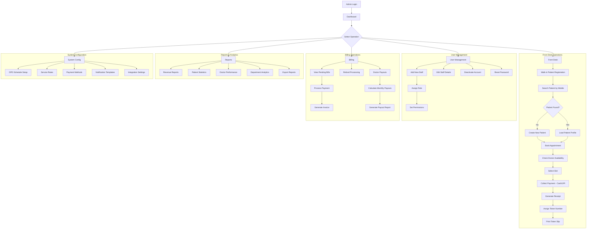
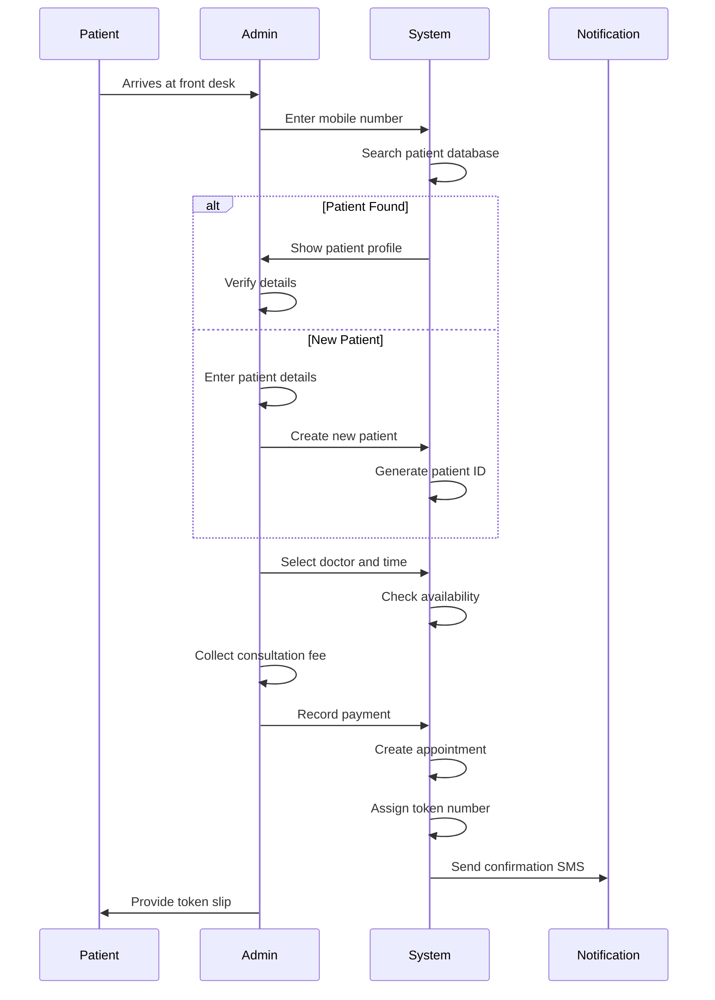
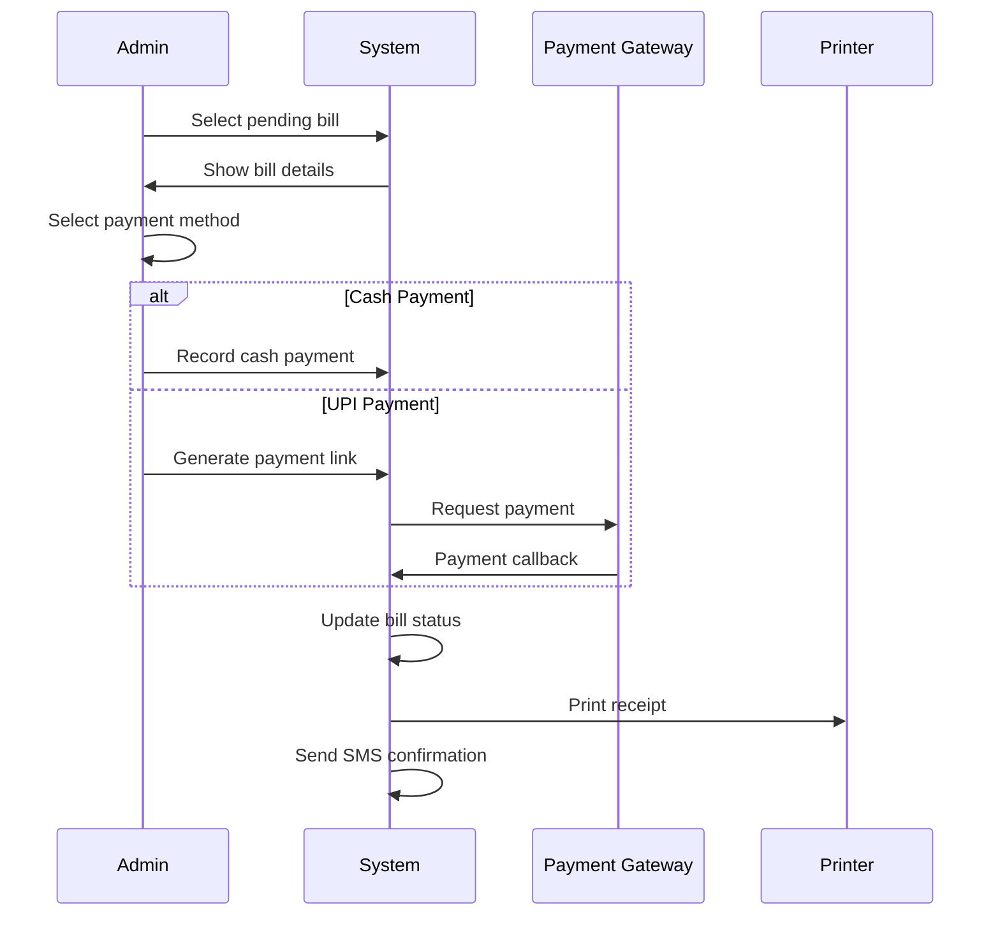

# Admin Module Specification

## Overview

The Admin Module serves as the central command center for hospital operations. It handles front desk operations (walk-in patient registration), user management, doctor availability management, billing and payments, doctor payout tracking, system configuration, and comprehensive reporting. Admins also manage the real-time queue and coordinate between departments.

---

## Role-Based Access Control

| Permission | Access Level |
|------------|--------------|
| Patient Registration | Full |
| Appointment Management | Full |
| User Management (Staff) | Full |
| Doctor Management | Full |
| Billing & Payments | Full |
| Queue Management | Full |
| Inventory Oversight | Read + Reports |
| Reports & Analytics | Full |
| System Configuration | Full |
| Doctor Payout Management | Full |
| Audit Logs | Full |

---

## User Journey Flow

### Admin Daily Operations



---

## Feature Specifications

### 1. Admin Dashboard

#### 1.1 Dashboard Components

| Component | Description | Data Source |
|-----------|-------------|-------------|
| Today's Overview | Total patients, revenue, appointments | Aggregated |
| Real-time Queue | Current queue status per department | `queue_entries` |
| Revenue Summary | Today's collection, pending bills | `payments`, `bills` |
| Staff On Duty | Active staff members | `users` |
| Alerts | Low stock, critical cases, pending tasks | Multiple |
| Quick Actions | Common tasks shortcuts | - |

#### 1.2 Dashboard Stats API

```
GET /api/admin/dashboard-stats
```

Response:
```json
{
  "success": true,
  "data": {
    "todayStats": {
      "totalPatients": 45,
      "newRegistrations": 8,
      "appointments": 52,
      "revenue": 125000,
      "pendingBills": 15
    },
    "queueStatus": [
      { "department": "Cardiology", "waiting": 5, "inProgress": 2 },
      { "department": "General", "waiting": 8, "inProgress": 1 }
    ],
    "alerts": [
      { "type": "inventory", "message": "5 medicines below reorder level" },
      { "type": "billing", "message": "12 pending invoices over 7 days" }
    ]
  }
}
```

---

### 2. Front Desk Operations

#### 2.1 Walk-in Patient Registration

**Flow:**


**Quick Registration Form:**

| Field | Type | Required | Notes |
|-------|------|----------|-------|
| Mobile Number | Text | Yes | Primary identifier |
| First Name | Text | Yes | - |
| Last Name | Text | Yes | - |
| Gender | Select | Yes | Male/Female/Other |
| Age | Number | Yes | Or DOB |
| Chief Complaint | Text | No | Reason for visit |

**API Endpoints:**
```
GET  /api/patients/search?mobile=9876543210
POST /api/patients/quick-register
POST /api/admin/walk-in-appointment
```

**Quick Register Request:**
```json
{
  "mobileNumber": "9876543210",
  "firstName": "John",
  "lastName": "Doe",
  "gender": "male",
  "dateOfBirth": "1990-05-15",
  "chiefComplaint": "Fever and cold"
}
```

#### 2.2 Appointment Management

**Features:**
- View all appointments (day/week/month)
- Filter by doctor, department, status
- Reschedule appointments
- Cancel appointments (with refund option)
- Send reminders for upcoming appointments

**Appointment List View:**
| Token | Patient | Doctor | Time | Status | Type | Actions |
|-------|---------|--------|------|--------|------|---------|
| 12 | John Doe | Dr. Kumar | 10:30 | Waiting | Walk-in | [View] [Reschedule] |
| 13 | Sarah W | Dr. Kumar | 11:00 | In Progress | Online | [View] |
| 14 | Mike C | Dr. Singh | 11:30 | Scheduled | Online | [View] [Cancel] |

**API Endpoints:**
```
GET    /api/admin/appointments
PUT    /api/admin/appointments/:id/reschedule
DELETE /api/admin/appointments/:id
POST   /api/admin/appointments/:id/refund
```

---

### 3. Queue Management

#### 3.1 Queue Dashboard

**Features:**
- Real-time view of all department queues
- Token status tracking
- Manual queue reorder
- Priority adjustment
- Token transfer between doctors

**Queue Management Screen:**
| Token | Patient | Doctor | Status | Wait Time | Priority | Actions |
|-------|---------|--------|--------|-----------|----------|---------|
| 12 | John Doe | Dr. Kumar | Waiting | 25 min | Normal | [↑] [↓] [Call] [Transfer] |
| 13 | Sarah W | Dr. Kumar | Waiting | 18 min | High | [↑] [↓] [Call] [Transfer] |
| 14 | Mike C | Dr. Singh | In Progress | - | Critical | [Complete] |

**API Endpoints:**
```
GET  /api/admin/queue
PUT  /api/admin/queue/:id/priority
POST /api/admin/queue/:id/transfer
POST /api/admin/queue/:id/call
PUT  /api/admin/queue/reorder
```

#### 3.2 Token Generation

**Token Slip Content:**
```
┌─────────────────────────────┐
│     CITY HOSPITAL           │
│     OPD TOKEN               │
├─────────────────────────────┤
│  Token No: #12              │
│  Patient: John Doe          │
│  Doctor: Dr. Rajesh Kumar   │
│  Dept: Cardiology           │
│  Date: 01-Mar-2026          │
│  Time: 10:30 AM             │
├─────────────────────────────┤
│  Please wait in the waiting │
│  area. You will be called   │
│  by your token number.      │
└─────────────────────────────┘
```

---

### 4. User Management (Staff)

#### 4.1 Staff Management

**Features:**
- Add new staff members
- Assign roles and permissions
- Manage login credentials
- Track staff activity
- Deactivate accounts

**Staff Roles:**
| Role | Description |
|------|-------------|
| Admin | Full system access |
| Doctor | Clinical operations |
| Nurse | Vitals and triage |
| Pharmacist | Pharmacy operations |
| Lab Tech | Lab operations |
| Receptionist | Front desk only |

**Add Staff Form:**
| Field | Type | Required |
|-------|------|----------|
| First Name | Text | Yes |
| Last Name | Text | Yes |
| Email | Email | Yes |
| Phone | Text | Yes |
| Role | Select | Yes |
| Department | Select | Conditional |
| Password | Password | Yes |
| Confirm Password | Password | Yes |

**API Endpoints:**
```
GET    /api/admin/users
POST   /api/admin/users
PUT    /api/admin/users/:id
DELETE /api/admin/users/:id
POST   /api/admin/users/:id/reset-password
GET    /api/admin/users/:id/activity
```

**Create Staff Request:**
```json
{
  "firstName": "Rajesh",
  "lastName": "Kumar",
  "email": "rajesh.kumar@hospital.com",
  "phone": "9876543210",
  "role": "DOCTOR",
  "department": "Cardiology",
  "password": "SecurePass123!"
}
```

#### 4.2 Doctor Management

**Additional Doctor Fields:**
| Field | Type | Description |
|-------|------|-------------|
| Qualifications | Text | MBBS, MD, etc. |
| Specialty | Select | Department |
| Consultation Fee | Number | In ₹ |
| Payout Percentage | Number | % of fee |
| Available Days | Multi-select | Mon-Sun |
| Available Hours | Time Range | 9 AM - 5 PM |
| Room Number | Text | Consultation room |

**API Endpoints:**
```
GET  /api/admin/doctors
POST /api/admin/doctors
PUT  /api/admin/doctors/:id
GET  /api/admin/doctors/:id/schedule
PUT  /api/admin/doctors/:id/schedule
```

---

### 5. Billing & Payments

#### 5.1 Billing Dashboard

**Features:**
- View all pending bills
- Process payments (Cash, UPI, Card)
- Generate invoices
- Handle refunds
- Payment history

**Pending Bills View:**
| Bill # | Patient | Date | Amount | Status | Type | Actions |
|--------|---------|------|--------|--------|------|---------|
| INV-001 | John Doe | 01-Mar | ₹1,500 | Pending | Consultation + Lab | [Pay] |
| INV-002 | Sarah W | 01-Mar | ₹500 | Partial | Pharmacy | [Pay] |
| INV-003 | Mike C | 28-Feb | ₹2,000 | Overdue | IPD | [Pay] [Remind] |

#### 5.2 Payment Processing

**Payment Flow:**


**Payment Methods:**
| Method | Processing | Transaction Fee |
|--------|------------|-----------------|
| Cash | Manual | None |
| UPI | Razorpay | 0% |
| Card | Razorpay | 1.5-2% |
| Net Banking | Razorpay | ₹5-15 |

**API Endpoints:**
```
GET  /api/admin/bills
GET  /api/admin/bills/:id
POST /api/admin/bills/:id/payment
POST /api/admin/bills/:id/refund
GET  /api/admin/payments
GET  /api/admin/payments/:id/receipt
```

**Process Payment Request:**
```json
{
  "billId": "uuid",
  "paymentMethod": "cash",
  "amount": 1500,
  "receivedBy": "admin_user_id",
  "notes": "Full payment received"
}
```

#### 5.3 Invoice Generation

**Invoice Content:**
```
┌────────────────────────────────────────┐
│           CITY HOSPITAL                │
│         GSTIN: 27XXXXX1234X1Z5         │
├────────────────────────────────────────┤
│ Invoice: INV-2026-000123   Date: 01/03/2026
│ Patient: John Doe         Patient ID: PT-001234
│ Doctor: Dr. Rajesh Kumar               │
├────────────────────────────────────────┤
│ Item                  │  Rate  │  Amt  │
├────────────────────────────────────────┤
│ Consultation Fee      │  500   │  500  │
│ Lab - Blood Test      │  300   │  300  │
│ Lab - Lipid Profile   │  700   │  700  │
├────────────────────────────────────────┤
│ Subtotal              │        │ 1500  │
│ Tax (18% GST)         │        │  270  │
│ Discount              │        │ -270  │
│ GRAND TOTAL           │        │ 1500  │
├────────────────────────────────────────┤
│ Payment: CASH         │ Paid   │ 1500  │
└────────────────────────────────────────┘
```

---

### 6. Doctor Payout Management

#### 6.1 Payout Dashboard

**Features:**
- Monthly payout calculation
- Per-doctor payout breakdown
- Payout history
- Export for accounting

**Payout Calculation:**
```
Doctor Payout = (Consultation Count × Fee) × Payout Percentage

Example:
- Dr. Kumar: 150 patients × ₹500 × 70% = ₹52,500
- Dr. Singh: 120 patients × ₹400 × 65% = ₹31,200
```

**Payout Report View:**
| Doctor | Patients | Total Revenue | Payout % | Calculated Payout | Status |
|--------|----------|---------------|----------|-------------------|--------|
| Dr. Kumar | 150 | ₹75,000 | 70% | ₹52,500 | Pending |
| Dr. Singh | 120 | ₹48,000 | 65% | ₹31,200 | Paid |
| Dr. Patel | 95 | ₹38,000 | 60% | ₹22,800 | Pending |
| **Total** | **365** | **₹161,000** | - | **₹106,500** | - |

**API Endpoints:**
```
GET  /api/admin/payouts
GET  /api/admin/payouts/:doctorId
POST /api/admin/payouts/calculate
PUT  /api/admin/payouts/:id/mark-paid
GET  /api/admin/payouts/export
```

**Payout Calculation Request:**
```json
{
  "month": 3,
  "year": 2026,
  "doctorIds": ["uuid1", "uuid2"]
}
```

**Payout Response:**
```json
{
  "success": true,
  "data": {
    "month": "March 2026",
    "payouts": [
      {
        "doctorId": "uuid",
        "doctorName": "Dr. Rajesh Kumar",
        "totalPatients": 150,
        "totalRevenue": 75000,
        "payoutPercentage": 70,
        "calculatedPayout": 52500,
        "status": "pending"
      }
    ],
    "totals": {
      "totalPatients": 365,
      "totalRevenue": 161000,
      "totalPayouts": 106500
    }
  }
}
```

---

### 7. Reports & Analytics

#### 7.1 Report Types

| Report | Description | Frequency |
|--------|-------------|-----------|
| Revenue Report | Daily, weekly, monthly revenue | Daily |
| Patient Statistics | New vs returning, demographics | Weekly |
| Doctor Performance | Patients seen, revenue generated | Monthly |
| Department Analytics | OPD footfall, wait times | Weekly |
| Inventory Status | Stock levels, expiry alerts | Daily |
| Collection Report | Payment collections, pending bills | Daily |
| Appointment Analytics | Booking sources, no-shows | Weekly |

#### 7.2 Revenue Report

**Daily Revenue Breakdown:**
| Category | Amount | % of Total |
|----------|--------|------------|
| Consultation Fees | ₹45,000 | 35% |
| Lab Tests | ₹35,000 | 27% |
| Pharmacy | ₹40,000 | 31% |
| Procedures | ₹8,000 | 7% |
| **Total** | **₹128,000** | **100%** |

**API Endpoints:**
```
GET /api/admin/reports/revenue?period=daily&date=2026-03-01
GET /api/admin/reports/patients?period=weekly
GET /api/admin/reports/doctors?period=monthly
GET /api/admin/reports/departments
GET /api/admin/reports/collection
GET /api/admin/reports/export?type=pdf
```

#### 7.3 Doctor Performance Report

| Doctor | Patients | Avg Consultation Time | Revenue | Rating | No-Shows |
|--------|----------|----------------------|---------|--------|----------|
| Dr. Kumar | 150 | 12 min | ₹75,000 | 4.8 | 5 |
| Dr. Singh | 120 | 15 min | ₹48,000 | 4.6 | 8 |
| Dr. Patel | 95 | 10 min | ₹38,000 | 4.9 | 3 |

---

### 8. System Configuration

#### 8.1 General Settings

| Setting | Description |
|---------|-------------|
| Hospital Name | Display name |
| Address | Location details |
| Contact Info | Phone, email |
| GST Number | For invoices |
| Working Hours | OPD timings |
| Slot Duration | Default 15/30 min |

#### 8.2 Service Rates

**Consultation Fees:**
| Department | Default Fee |
|------------|-------------|
| General Medicine | ₹300 |
| Cardiology | ₹500 |
| Orthopedics | ₹400 |
| Pediatrics | ₹350 |

**Lab Test Rates:**
| Test | Rate |
|------|------|
| Complete Blood Count | ₹300 |
| Lipid Profile | ₹700 |
| Thyroid Panel | ₹800 |

#### 8.3 Notification Templates

**Configurable Templates:**
- Appointment confirmation
- Queue update
- Payment receipt
- Lab report ready
- Follow-up reminder

**API Endpoints:**
```
GET  /api/admin/settings
PUT  /api/admin/settings
GET  /api/admin/settings/services
PUT  /api/admin/settings/services
GET  /api/admin/settings/templates
PUT  /api/admin/settings/templates/:id
```

---

### 9. Audit Logs

#### 9.1 Audit Trail

**Features:**
- Track all user actions
- Filter by user, action type, date
- View before/after values
- Export logs

**Audit Log View:**
| Timestamp | User | Role | Action | Entity | Details |
|-----------|------|------|--------|--------|---------|
| 10:30 AM | Admin1 | Admin | Create | Patient | New patient John Doe |
| 10:35 AM | Admin1 | Admin | Update | Appointment | Rescheduled to 11:00 |
| 10:45 AM | Dr. Kumar | Doctor | Create | Prescription | For patient PT-001234 |

**API Endpoints:**
```
GET /api/admin/audit-logs
GET /api/admin/audit-logs/:id
```

---

## UI Components Required

### Pages

| Page | Route | Description |
|------|-------|-------------|
| Dashboard | `/admin/dashboard` | Main overview |
| Front Desk | `/admin/front-desk` | Walk-in registration |
| Appointments | `/admin/appointments` | All appointments |
| Queue | `/admin/queue` | Queue management |
| Users | `/admin/users` | Staff management |
| Doctors | `/admin/doctors` | Doctor management |
| Billing | `/admin/billing` | Bills and payments |
| Payouts | `/admin/payouts` | Doctor payouts |
| Reports | `/admin/reports` | Analytics |
| Settings | `/admin/settings` | System config |
| Audit Logs | `/admin/audit-logs` | Activity tracking |

### Components

| Component | Description |
|-----------|-------------|
| `QuickRegistrationForm` | Fast patient registration |
| `AppointmentTable` | Sortable/filterable list |
| `QueueBoard` | Visual queue management |
| `StaffForm` | Add/edit staff |
| `DoctorForm` | Doctor details form |
| `BillProcessor` | Payment processing |
| `PayoutCalculator` | Payout computation |
| `ReportViewer` | Report display with charts |
| `SettingsPanel` | Configuration forms |
| `AuditLogTable` | Audit trail display |

---

## Database Tables Used

| Table | Purpose |
|-------|---------|
| `users` | Staff accounts |
| `patients` | Patient records |
| `appointments` | Bookings |
| `queue_entries` | Daily queue |
| `bills` | Invoices |
| `payments` | Payment records |
| `audit_logs` | Activity tracking |
| `notifications` | Alerts |
| `lab_orders` | Lab billing |
| `prescriptions` | Pharmacy billing |
| `inventory` | Stock levels (read) |

---

## Integration Points

| Module | Integration Type |
|--------|------------------|
| All Modules | Full access |
| Payment Gateway | Razorpay |
| SMS Gateway | Notifications |
| WhatsApp API | Patient alerts |
| Reporting Engine | Analytics |
| Export Service | PDF/Excel |

---

## API Endpoints Summary

### Dashboard
```
GET /api/admin/dashboard-stats
```

### Front Desk
```
GET  /api/patients/search
POST /api/patients/quick-register
POST /api/admin/walk-in-appointment
```

### Appointments
```
GET    /api/admin/appointments
PUT    /api/admin/appointments/:id/reschedule
DELETE /api/admin/appointments/:id
POST   /api/admin/appointments/:id/refund
```

### Queue
```
GET  /api/admin/queue
PUT  /api/admin/queue/:id/priority
POST /api/admin/queue/:id/transfer
POST /api/admin/queue/:id/call
```

### Users
```
GET    /api/admin/users
POST   /api/admin/users
PUT    /api/admin/users/:id
DELETE /api/admin/users/:id
POST   /api/admin/users/:id/reset-password
```

### Doctors
```
GET  /api/admin/doctors
POST /api/admin/doctors
PUT  /api/admin/doctors/:id
PUT  /api/admin/doctors/:id/schedule
```

### Billing
```
GET  /api/admin/bills
GET  /api/admin/bills/:id
POST /api/admin/bills/:id/payment
POST /api/admin/bills/:id/refund
GET  /api/admin/payments
```

### Payouts
```
GET  /api/admin/payouts
POST /api/admin/payouts/calculate
PUT  /api/admin/payouts/:id/mark-paid
GET  /api/admin/payouts/export
```

### Reports
```
GET /api/admin/reports/revenue
GET /api/admin/reports/patients
GET /api/admin/reports/doctors
GET /api/admin/reports/departments
GET /api/admin/reports/collection
GET /api/admin/reports/export
```

### Settings
```
GET /api/admin/settings
PUT /api/admin/settings
```

### Audit
```
GET /api/admin/audit-logs
```

---

## Implementation Priority

| Priority | Feature | Dependencies |
|----------|---------|--------------|
| P0 | Dashboard | Auth, All modules |
| P0 | Front Desk Registration | Patient module |
| P0 | Queue Management | Queue system |
| P0 | Billing & Payments | Payment gateway |
| P1 | User Management | Auth system |
| P1 | Doctor Management | Doctor module |
| P1 | Payout Tracking | Billing data |
| P2 | Reports & Analytics | All modules |
| P2 | System Configuration | Settings store |
| P3 | Audit Logs | Logging system |

---

## Notes for Development

1. **Role-Based UI**: Show/hide features based on admin sub-role (Super Admin vs Receptionist)
2. **Real-time Updates**: Dashboard should auto-refresh every 30 seconds
3. **Bulk Operations**: Support bulk actions for appointments, bills
4. **Export Options**: PDF and Excel export for all reports
5. **Audit Everything**: Log all admin actions for accountability
6. **Offline Mode**: Queue management should work offline with sync
7. **Print Integration**: Direct print for tokens, receipts, invoices
8. **Multi-location**: Design for future multi-branch support
