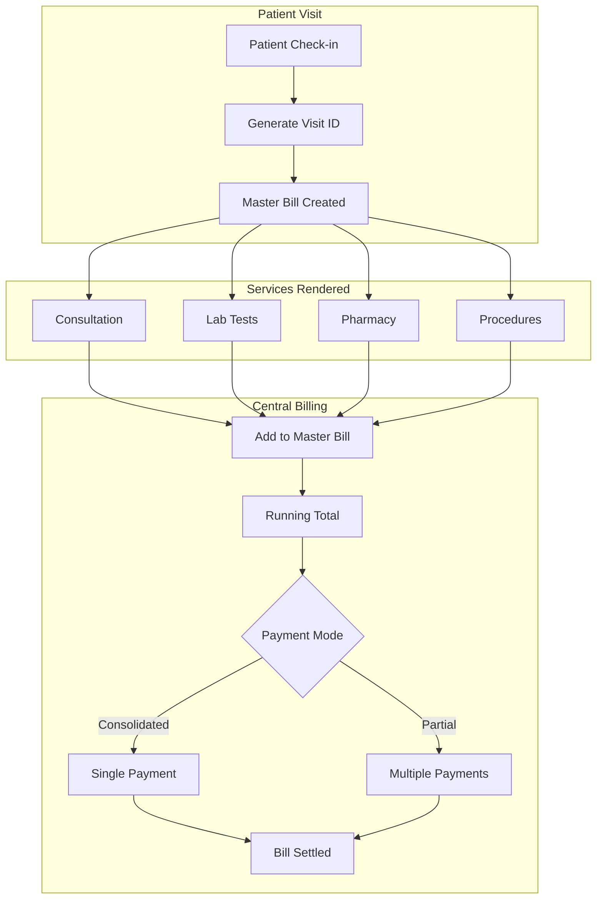
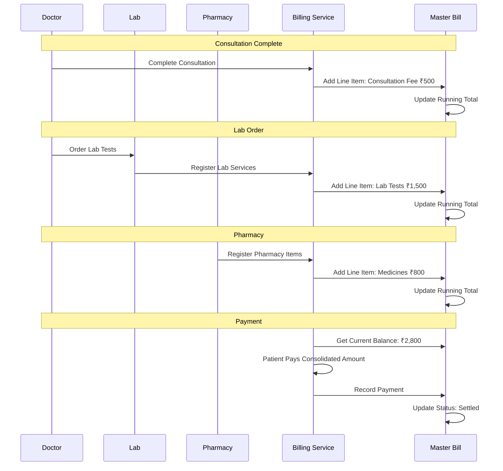
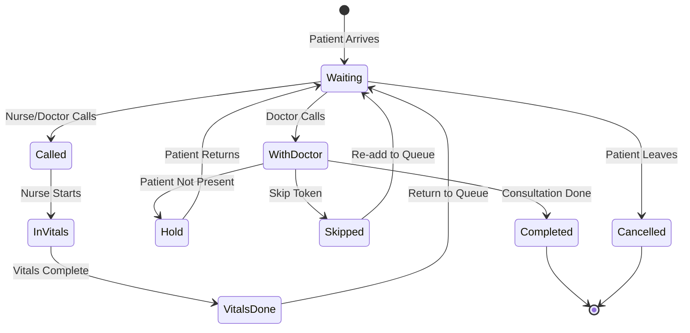
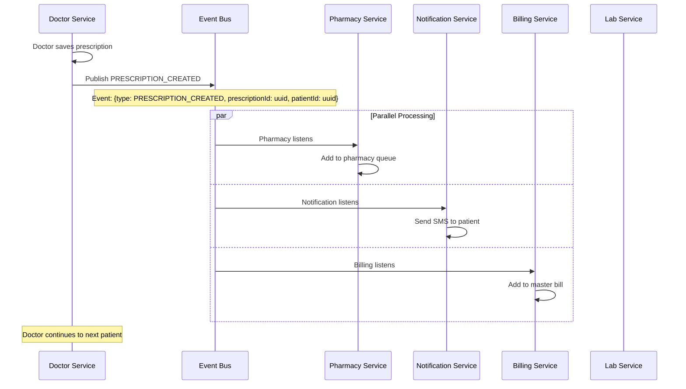

# HMS Architecture Enhancements

This document covers critical architectural enhancements required for a production-ready Hospital Management System.

---

## 1. Multi-Tenancy Architecture (SaaS Model)

### Overview

If VIMS Enterprise plans to sell this HMS as a SaaS product to multiple hospitals, every table needs a `hospital_id` or `tenant_id` from Day 1. Without this, refactoring later will be extremely costly.

### Multi-Tenancy Models

| Model | Description | Pros | Cons |
|-------|-------------|------|------|
| **Shared Database, Shared Schema** | All tenants share tables with tenant_id column | Cost-effective, easy maintenance | Data isolation concerns |
| **Shared Database, Separate Schema** | Each tenant has own schema | Better isolation, moderate cost | More complex queries |
| **Separate Database** | Each tenant has own database | Best isolation, compliance-friendly | Higher cost, maintenance |

**Recommended: Shared Database, Shared Schema** with row-level security for cost-effectiveness.

### Database Schema Changes

```prisma
// Add tenant_id to ALL tables
model Hospital {
  id              String   @id @default(uuid())
  name            String
  code            String   @unique  // Unique hospital code
  subdomain       String   @unique  // e.g., cityhospital.vims.com
  logo            String?
  address         String
  city            String
  state           String
  pincode         String
  gstNumber       String?  @map("gst_number")
  contactEmail    String?  @map("contact_email")
  contactPhone    String?  @map("contact_phone")
  isActive        Boolean  @default(true)
  planType        String   @default("standard") // basic, standard, premium
  createdAt       DateTime @default(now())
  
  users           User[]
  patients        Patient[]
  appointments    Appointment[]
  // ... all other relations
  
  @@map("hospitals")
}

// Update ALL existing tables
model User {
  id          String   @id @default(uuid())
  hospitalId  String   @map("hospital_id")
  email       String
  // ... other fields
  
  hospital    Hospital @relation(fields: [hospitalId], references: [id])
  
  @@unique([hospitalId, email])  // Email unique per hospital
  @@map("users")
}

model Patient {
  id          String   @id @default(uuid())
  hospitalId  String   @map("hospital_id")
  patientNumber String
  // ... other fields
  
  hospital    Hospital @relation(fields: [hospitalId], references: [id])
  
  @@unique([hospitalId, patientNumber])  // Patient number unique per hospital
  @@map("patients")
}

// Apply to ALL tables: appointments, consultations, prescriptions, lab_orders, bills, etc.
```

### Tenant Context Middleware

```typescript
// middleware/tenant.middleware.ts
export const tenantMiddleware = async (req: Request, res: Response, next: NextFunction) => {
  // Get tenant from subdomain, header, or JWT
  const tenantId = extractTenantId(req);
  
  if (!tenantId) {
    return res.status(400).json({ error: 'Tenant identification required' });
  }
  
  // Set tenant context for the request
  req.tenantId = tenantId;
  
  // Add tenant filter to all Prisma queries
  prisma.$use(async (params, next) => {
    if (params.model && !params.args?.where?.hospital_id) {
      params.args.where = {
        ...params.args.where,
        hospital_id: tenantId
      };
    }
    return next(params);
  });
  
  next();
};
```

### Tenant-Specific Configurations

| Configuration | Scope |
|---------------|-------|
| OPD Timings | Per Hospital |
| Service Rates | Per Hospital |
| Doctor Payout % | Per Hospital |
| Notification Templates | Per Hospital |
| Payment Gateway | Per Hospital (or platform) |
| SMS/WhatsApp Sender ID | Per Hospital |

### API Changes

All API endpoints automatically filter by tenant:
```
GET /api/patients → Returns patients for current hospital only
POST /api/appointments → Creates appointment for current hospital
```

---

## 2. Centralized Billing System (Master Bill)

### Overview

Instead of fragmented billing (Consultation at Admin, Lab at Lab, Pharmacy at Pharmacy), implement a **Central Ledger** or **Master Bill** per patient visit. This allows:
- Consolidated payments
- Easy refunds
- Daily reconciliation
- Better patient experience

### Master Bill Architecture



### Database Schema

```prisma
model PatientVisit {
  id              String   @id @default(uuid())
  visitNumber     String   @unique @map("visit_number")  // VIS-2026-000123
  patientId       String   @map("patient_id")
  hospitalId      String   @map("hospital_id")
  checkInAt       DateTime @default(now()) @map("check_in_at")
  checkOutAt      DateTime? @map("check_out_at")
  status          String   @default("active") // active, discharged, cancelled
  masterBillId    String?  @map("master_bill_id")
  
  patient         Patient  @relation(fields: [patientId], references: [id])
  masterBill      MasterBill?
  consultations   Consultation[]
  labOrders       LabOrder[]
  pharmacyDispense PharmacyDispense[]
  
  @@map("patient_visits")
}

model MasterBill {
  id              String   @id @default(uuid())
  billNumber      String   @unique @map("bill_number")  // MB-2026-000123
  visitId         String   @map("visit_id")
  patientId       String   @map("patient_id")
  hospitalId      String   @map("hospital_id")
  
  // Running totals
  consultationTotal Decimal @default(0) @map("consultation_total")
  labTotal          Decimal @default(0) @map("lab_total")
  pharmacyTotal     Decimal @default(0) @map("pharmacy_total")
  procedureTotal    Decimal @default(0) @map("procedure_total")
  otherTotal        Decimal @default(0) @map("other_total")
  
  subtotal        Decimal  @default(0)
  discount        Decimal  @default(0)
  tax             Decimal  @default(0)
  totalAmount     Decimal  @default(0) @map("total_amount")
  amountPaid      Decimal  @default(0) @map("amount_paid")
  balanceDue      Decimal  @default(0) @map("balance_due")
  
  status          String   @default("open") // open, partial, settled, refunded
  generatedAt     DateTime @default(now()) @map("generated_at")
  settledAt       DateTime? @map("settled_at")
  
  lineItems       MasterBillLineItem[]
  payments        Payment[]
  visit           PatientVisit @relation(fields: [visitId], references: [id])
  
  @@map("master_bills")
}

model MasterBillLineItem {
  id              String   @id @default(uuid())
  masterBillId    String   @map("master_bill_id")
  itemType        String   // CONSULTATION, LAB, PHARMACY, PROCEDURE
  itemReference   String   @map("item_reference")  // UUID of the actual item
  description     String
  quantity        Int      @default(1)
  rate            Decimal
  amount          Decimal
  status          String   @default("pending") // pending, paid, cancelled
  addedAt         DateTime @default(now()) @map("added_at")
  
  masterBill      MasterBill @relation(fields: [masterBillId], references: [id])
  
  @@map("master_bill_line_items")
}
```

### Service Integration Flow



### Central Billing API

**Get Master Bill:**
```
GET /api/billing/master-bill/:visitId
```

Response:
```json
{
  "success": true,
  "data": {
    "billNumber": "MB-2026-000123",
    "visitNumber": "VIS-2026-000456",
    "patient": {
      "name": "John Doe",
      "mobile": "9876543210"
    },
    "lineItems": [
      {
        "type": "CONSULTATION",
        "description": "Consultation - Dr. Rajesh Kumar",
        "amount": 500,
        "status": "pending"
      },
      {
        "type": "LAB",
        "description": "Lab Tests - CBC, Lipid Profile",
        "amount": 1000,
        "status": "pending"
      },
      {
        "type": "PHARMACY",
        "description": "Medicines - 3 items",
        "amount": 630,
        "status": "pending"
      }
    ],
    "summary": {
      "subtotal": 2130,
      "discount": 0,
      "tax": 106.50,
      "totalAmount": 2236.50,
      "amountPaid": 0,
      "balanceDue": 2236.50
    },
    "status": "open"
  }
}
```

**Add Line Item:**
```
POST /api/billing/master-bill/:visitId/line-item
```

**Process Payment:**
```
POST /api/billing/master-bill/:visitId/payment
```

**Settle Bill:**
```
POST /api/billing/master-bill/:visitId/settle
```

### Payment Flexibility

| Option | Description |
|--------|-------------|
| Consolidated Payment | Pay full amount at central counter |
| Department-wise | Pay at each department (still tracked in master) |
| Partial Payment | Pay in installments against master bill |
| Advance Deposit | Pre-pay against future services |
| Refund | Single point refund processing |

---

## 3. Queue Management Enhancements

### Enhanced Queue Statuses

The original flow (waiting → vitals-done → with-doctor) is too rigid. Add more statuses:



### Enhanced Status Definitions

| Status | Description | Color | Actions |
|--------|-------------|-------|---------|
| `WAITING` | In queue, waiting for turn | Grey | Call, Skip |
| `CALLED` | Called but not responded | Yellow | Hold, Skip |
| `IN_VITALS` | With nurse for vitals | Blue | Complete Vitals |
| `VITALS_DONE` | Vitals recorded, waiting for doctor | Light Green | Call to Doctor |
| `WITH_DOCTOR` | Currently in consultation | Green | Complete, Hold |
| `HOLD` | Patient stepped away | Orange | Resume, Skip |
| `SKIPPED` | Skipped, will be recalled | Purple | Recall |
| `COMPLETED` | Consultation finished | Dark Green | - |
| `CANCELLED` | Left without consultation | Red | - |

### Hold/Skip Functionality

**Hold Flow:**
```
┌─────────────────────────────────────────────────────┐
│  TOKEN #12 - ON HOLD                                │
│  Patient: John Doe                                  │
│  Reason: Patient in washroom                        │
│  Hold Time: 5 minutes                               │
│                                                     │
│  [Resume] [Skip - Push back 3 positions]           │
└─────────────────────────────────────────────────────┘
```

**Skip Logic:**
- First Skip: Push back 3 positions
- Second Skip: Push back 5 positions
- Third Skip: Move to end of queue
- Auto-hold after 10 minutes of no-show

### Database Schema Update

```prisma
model QueueEntry {
  id              String   @id @default(uuid())
  queueNumber     Int      @map("queue_number")
  status          String   @default("WAITING")
  priority        Int      @default(0)
  
  // Enhanced fields
  holdCount       Int      @default(0) @map("hold_count")
  skipCount       Int      @default(0) @map("skip_count")
  holdReason      String?  @map("hold_reason")
  holdStartedAt   DateTime? @map("hold_started_at")
  calledAt        DateTime? @map("called_at")
  vitalsStartedAt DateTime? @map("vitals_started_at")
  vitalsDoneAt    DateTime? @map("vitals_done_at")
  doctorStartedAt DateTime? @map("doctor_started_at")
  completedAt     DateTime? @map("completed_at")
  
  // Position tracking
  originalPosition Int?    @map("original_position")
  currentPosition  Int?    @map("current_position")
  
  createdAt       DateTime @default(now())
  updatedAt       DateTime @updatedAt
  
  patientId       String   @map("patient_id")
  doctorId        String?  @map("doctor_id")
  hospitalId      String   @map("hospital_id")
  
  @@map("queue_entries")
}
```

### Queue Management API

**Hold Patient:**
```
POST /api/queue/:id/hold
```

Request:
```json
{
  "reason": "Patient in washroom",
  "estimatedReturnMinutes": 5
}
```

**Skip Patient:**
```
POST /api/queue/:id/skip
```

Response:
```json
{
  "success": true,
  "data": {
    "queueEntryId": "uuid",
    "tokenNumber": 12,
    "newPosition": 15,
    "skipCount": 1,
    "message": "Token #12 moved to position 15"
  }
}
```

**Resume Patient:**
```
POST /api/queue/:id/resume
```

---

## 4. Event-Driven Architecture

### Overview

The system relies heavily on real-time updates. Using synchronous API calls will cause failures if one module crashes. Implement an **Event Bus** for resilience.

### Event Bus Options

| Technology | Use Case | Complexity |
|------------|----------|------------|
| Redis Pub/Sub | Simple events, low volume | Low |
| RabbitMQ | Reliable delivery, queues | Medium |
| Apache Kafka | High volume, event sourcing | High |

**Recommended: Redis Pub/Sub** for MVP, RabbitMQ for production scale.

### Event-Driven Flow



### Event Definitions

```typescript
// types/events.ts
export enum EventType {
  // Patient Events
  PATIENT_REGISTERED = 'PATIENT_REGISTERED',
  PATIENT_VERIFIED = 'PATIENT_VERIFIED',
  ABHA_LINKED = 'ABHA_LINKED',
  
  // Appointment Events
  APPOINTMENT_BOOKED = 'APPOINTMENT_BOOKED',
  APPOINTMENT_CANCELLED = 'APPOINTMENT_CANCELLED',
  APPOINTMENT_REMINDER = 'APPOINTMENT_REMINDER',
  
  // Queue Events
  QUEUE_ENTERED = 'QUEUE_ENTERED',
  QUEUE_CALLED = 'QUEUE_CALLED',
  QUEUE_SKIPPED = 'QUEUE_SKIPPED',
  QUEUE_COMPLETED = 'QUEUE_COMPLETED',
  
  // Vitals Events
  VITALS_RECORDED = 'VITALS_RECORDED',
  VITALS_ALERT = 'VITALS_ALERT',
  
  // Consultation Events
  CONSULTATION_STARTED = 'CONSULTATION_STARTED',
  CONSULTATION_COMPLETED = 'CONSULTATION_COMPLETED',
  
  // Prescription Events
  PRESCRIPTION_CREATED = 'PRESCRIPTION_CREATED',
  PRESCRIPTION_DISPENSED = 'PRESCRIPTION_DISPENSED',
  
  // Lab Events
  LAB_ORDER_CREATED = 'LAB_ORDER_CREATED',
  LAB_SAMPLE_COLLECTED = 'LAB_SAMPLE_COLLECTED',
  LAB_RESULTS_READY = 'LAB_RESULTS_READY',
  LAB_CRITICAL_RESULT = 'LAB_CRITICAL_RESULT',
  
  // Billing Events
  BILL_GENERATED = 'BILL_GENERATED',
  PAYMENT_RECEIVED = 'PAYMENT_RECEIVED',
  REFUND_PROCESSED = 'REFUND_PROCESSED',
  
  // Inventory Events
  LOW_STOCK_ALERT = 'LOW_STOCK_ALERT',
  STOCK_UPDATED = 'STOCK_UPDATED'
}

export interface Event<T = any> {
  id: string;
  type: EventType;
  timestamp: Date;
  hospitalId: string;
  payload: T;
  metadata?: Record<string, any>;
}
```

### Event Publisher

```typescript
// services/event.service.ts
import { Redis } from 'ioredis';

class EventBus {
  private publisher: Redis;
  
  constructor() {
    this.publisher = new Redis(process.env.REDIS_URL);
  }
  
  async publish<T>(eventType: EventType, payload: T, hospitalId: string): Promise<void> {
    const event = {
      id: uuidv4(),
      type: eventType,
      timestamp: new Date(),
      hospitalId,
      payload
    };
    
    await this.publisher.publish('hms:events', JSON.stringify(event));
    
    // Also store for audit/replay
    await this.storeEvent(event);
  }
  
  private async storeEvent(event: Event): Promise<void> {
    // Store in event store for audit trail and replay capability
    await prisma.eventStore.create({
      data: {
        id: event.id,
        type: event.type,
        timestamp: event.timestamp,
        hospitalId: event.hospitalId,
        payload: event.payload
      }
    });
  }
}

export const eventBus = new EventBus();
```

### Event Subscribers

```typescript
// subscribers/notification.subscriber.ts
class NotificationSubscriber {
  private subscriber: Redis;
  
  constructor() {
    this.subscriber = new Redis(process.env.REDIS_URL);
    this.setupSubscriptions();
  }
  
  private setupSubscriptions() {
    this.subscriber.subscribe('hms:events');
    
    this.subscriber.on('message', async (channel, message) => {
      const event = JSON.parse(message);
      
      switch (event.type) {
        case EventType.PRESCRIPTION_CREATED:
          await this.handlePrescriptionCreated(event);
          break;
        case EventType.LAB_RESULTS_READY:
          await this.handleLabResultsReady(event);
          break;
        case EventType.QUEUE_CALLED:
          await this.handleQueueCalled(event);
          break;
        // ... other handlers
      }
    });
  }
  
  private async handlePrescriptionCreated(event: Event) {
    const { patientId, prescriptionId } = event.payload;
    
    // Get patient details
    const patient = await prisma.patient.findUnique({ where: { id: patientId } });
    
    // Send SMS
    await smsService.send(patient.phone, 
      `Your prescription is ready. Visit pharmacy to collect medicines.`
    );
    
    // Send WhatsApp
    await whatsappService.send(patient.phone,
      `🏥 *Prescription Ready*\n\nYour prescription from your recent consultation is ready.\n\nPlease visit the pharmacy to collect your medicines.`
    );
  }
}
```

### Event Store for Audit

```prisma
model EventStore {
  id          String   @id
  type        String
  timestamp   DateTime
  hospitalId  String   @map("hospital_id")
  payload     Json
  processed   Boolean  @default(false)
  processedAt DateTime? @map("processed_at")
  
  @@index([type])
  @@index([hospitalId])
  @@index([timestamp])
  @@map("event_store")
}
```

### Benefits of Event-Driven Architecture

| Benefit | Description |
|---------|-------------|
| **Decoupling** | Services don't depend on each other directly |
| **Resilience** | If notification fails, prescription still saved |
| **Scalability** | Add more subscribers without changing publishers |
| **Audit Trail** | All events stored for compliance |
| **Replay** | Can replay events to rebuild state |
| **Real-time** | WebSocket can subscribe to event stream |

---

## 5. Implementation Checklist

### Phase 1: Foundation
- [ ] Add `hospital_id` to all tables
- [ ] Implement tenant middleware
- [ ] Set up Redis for event bus
- [ ] Create event store table

### Phase 2: Billing
- [ ] Create Master Bill tables
- [ ] Implement line item addition from all services
- [ ] Build consolidated payment flow
- [ ] Add refund processing

### Phase 3: Queue
- [ ] Add new queue statuses
- [ ] Implement Hold functionality
- [ ] Implement Skip with position management
- [ ] Add auto-hold for no-shows

### Phase 4: Events
- [ ] Define all event types
- [ ] Implement event publisher
- [ ] Create notification subscriber
- [ ] Create billing subscriber
- [ ] Create audit subscriber

### Phase 5: Testing
- [ ] Multi-tenant isolation tests
- [ ] Event replay tests
- [ ] Queue edge case tests
- [ ] Billing reconciliation tests

---

## 6. Summary

| Enhancement | Priority | Impact |
|-------------|----------|--------|
| Multi-Tenancy | **P0 - Critical** | Required for SaaS model |
| Event-Driven Architecture | **P0 - Critical** | Required for reliability |
| Centralized Billing | **P1 - High** | Improves patient experience |
| Queue Hold/Skip | **P1 - High** | Handles real-world scenarios |
| ICD-10 Coding | **P1 - High** | Required for insurance/TPA |
| ABHA Integration | **P1 - High** | Required for ABDM compliance |
| Dependents Management | **P2 - Medium** | Common Indian use case |
| Pharmacy Substitution Rules | **P1 - High** | Legal compliance |
