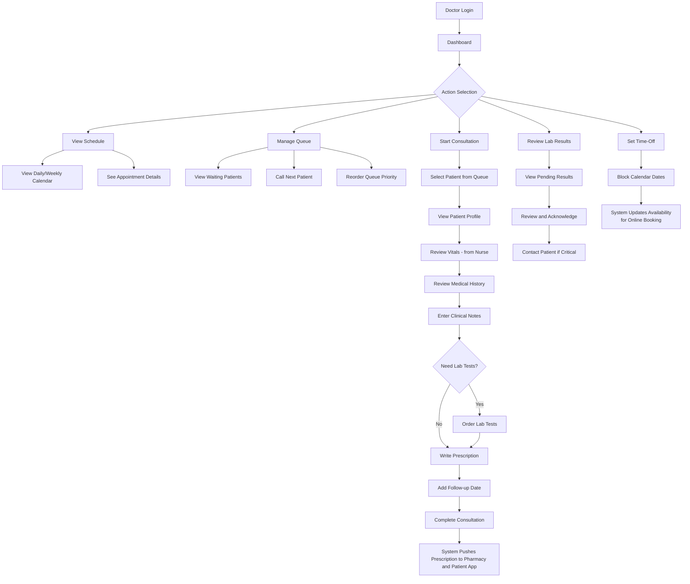
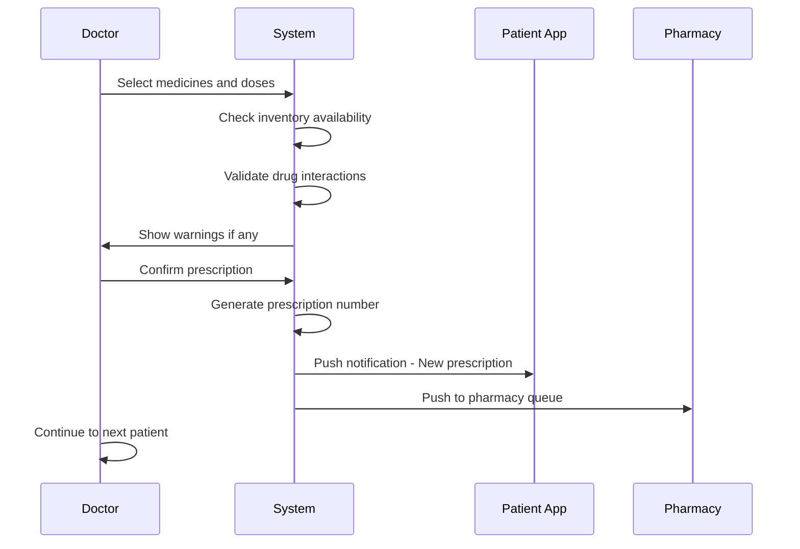
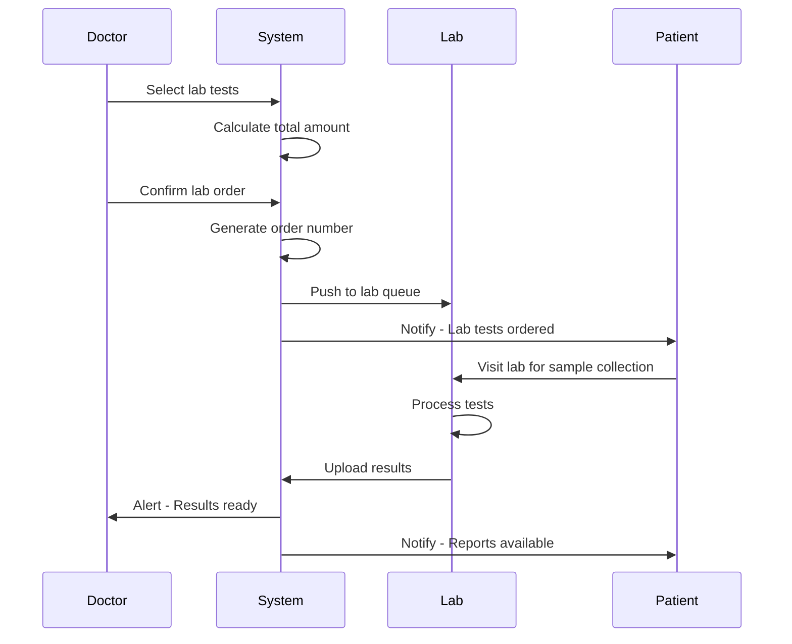

# Doctor Module Specification

## Overview

The Doctor Module is the core clinical decision-making interface in the HMS. Doctors use this portal to manage their schedule, view waiting patients, access patient vitals and history, conduct consultations, prescribe medications, and order lab tests.

---

## Role-Based Access Control

| Permission | Access Level |
|------------|--------------|
| View own schedule | Full |
| Manage own time-offs | Full |
| View patient queue | Full |
| Access patient records | Full (for assigned patients) |
| Create consultations | Full |
| Write prescriptions | Full |
| Order lab tests | Full |
| View lab results | Full |
| Access pharmacy inventory | Read-only |
| View payout reports | Full (own data) |

---

## User Journey Flow



---

## Feature Specifications

### 1. Doctor Dashboard

#### 1.1 Dashboard Components

| Component | Description | Data Source |
|-----------|-------------|-------------|
| Today's Summary | Total patients, completed, remaining | `appointments` + `queue_entries` |
| AI Assistant | Highlights critical cases, pending lab alerts | Aggregated from multiple tables |
| Queue Overview | Real-time waiting patients list | `queue_entries` + `patients` |
| Upcoming Appointments | Next 5 scheduled appointments | `appointments` |
| Lab Alerts | Critical/abnormal results pending review | `lab_order_items` |
| Messages | Internal communication notifications | `notifications` |

#### 1.2 Dashboard Stats API

```
GET /api/doctor/dashboard-stats
```

Response:
```json
{
  "success": true,
  "data": {
    "todayTotal": 15,
    "completed": 7,
    "remaining": 8,
    "criticalAlerts": 2,
    "pendingLabReviews": 3,
    "nextAppointment": {
      "id": "uuid",
      "time": "10:30",
      "patientName": "John Doe",
      "type": "Follow-up"
    }
  }
}
```

---

### 2. Schedule Management

#### 2.1 View Schedule

**UI Components:**
- Calendar view (Day/Week/Month toggle)
- Time slots with appointment status indicators
- Color coding: Completed (Green), In Progress (Blue), Upcoming (Grey), Cancelled (Red)

**API Endpoints:**

```
GET /api/doctor/schedule?date=2026-03-01&view=day
GET /api/doctor/appointments/:appointmentId
```

#### 2.2 Manage Time-Offs

**Features:**
- Block single day or date range
- Set recurring unavailability (e.g., every Wednesday)
- Add reason for time-off (optional)
- Time-off instantly reflects in online booking system

**Data Model:**
```prisma
model DoctorTimeOff {
  id          String   @id @default(uuid())
  doctorId    String
  startDate   DateTime
  endDate     DateTime
  reason      String?
  isRecurring Boolean  @default(false)
  recurrencePattern String? // e.g., "weekly:wednesday"
  createdAt   DateTime @default(now())
  
  doctor      User     @relation(fields: [doctorId], references: [id])
}
```

**API Endpoints:**
```
POST   /api/doctor/time-offs
GET    /api/doctor/time-offs
DELETE /api/doctor/time-offs/:id
```

---

### 3. Queue Management

#### 3.1 Patient Queue View

**UI Components:**
- Real-time queue list with patient tokens
- Patient name, age, reason for visit
- Urgency level indicator (Critical/High/Medium/Low)
- Wait time display
- Quick action buttons: Call, View Profile, Reorder

**Queue Entry Display:**
| Token | Patient Name | Age | Reason | Urgency | Wait Time | Actions |
|-------|--------------|-----|--------|---------|-----------|---------|
| 12 | John Doe | 45 | Follow-up - Hypertension | High | 25 min | [Call] [View] |
| 13 | Sarah Wilson | 32 | New Consultation | Medium | 18 min | [Call] [View] |
| 14 | Michael Chen | 58 | Chest Pain Evaluation | Critical | 10 min | [Call] [View] |

**API Endpoints:**
```
GET  /api/doctor/queue
POST /api/doctor/queue/:id/call
PUT  /api/doctor/queue/reorder
```

#### 3.2 Real-Time Queue Updates

- WebSocket integration for live queue changes
- Notification when new patient enters queue
- Alert when patient vitals are updated

---

### 4. Consultation Workflow

#### 4.1 Patient Selection

When doctor clicks on a patient from queue:

```
GET /api/doctor/patient/:patientId/consultation-data
```

Response includes:
- Patient profile (demographics, allergies)
- Current vitals (from nurse triage)
- Medical history (pre-existing conditions)
- Previous consultations
- Active medications

#### 4.2 Consultation Form

**Sections:**

| Section | Fields | Required |
|---------|--------|----------|
| Chief Complaint | Text input | Yes |
| Present Illness History | Rich text | No |
| Examination Findings | Rich text | No |
| Provisional Diagnosis | Text + ICD-10 codes | Yes |
| Final Diagnosis | Text + ICD-10 codes | No |
| Advice/Instructions | Rich text | No |
| Follow-up Date | Date picker | No |

**Auto-Save Feature:**
- Auto-save every 30 seconds
- Draft indicator showing last saved time

#### 4.3 ICD-10 Coding Integration

ICD-10 (International Classification of Diseases, 10th Revision) coding is **mandatory** for standardized reporting, insurance claims (Mediclaim/TPA), and regulatory compliance.

**ICD-10 Search Interface:**
```
┌─────────────────────────────────────────────────────┐
│  DIAGNOSIS WITH ICD-10 CODING                       │
├─────────────────────────────────────────────────────┤
│  Search ICD-10: [hyper...]                          │
│                                                     │
│  Results:                                           │
│  ○ I10 - Essential (primary) hypertension          │
│  ○ I11.9 - Hypertensive heart disease without heart failure │
│  ○ I15 - Secondary hypertension                    │
│  ○ E11.9 - Type 2 diabetes mellitus without complications │
│                                                     │
│  Selected Codes:                                    │
│  ┌─────────────────────────────────────────────┐   │
│  │ I10 - Essential hypertension         [Remove]│   │
│  │ E11.9 - Type 2 diabetes mellitus     [Remove]│   │
│  └─────────────────────────────────────────────┘   │
│                                                     │
│  Clinical Description:                              │
│  [Patient presents with uncontrolled hypertension...]│
│                                                     │
│  [Add More Codes] [Save Diagnosis]                  │
└─────────────────────────────────────────────────────┘
```

**ICD-10 Code Structure:**
| Component | Format | Example |
|-----------|--------|---------|
| Category | 3 characters | I10 |
| Subcategory | 1-4 characters | I10.9 |
| Description | Text | Essential hypertension |

**Common ICD-10 Codes by Specialty:**

| Specialty | Code | Description |
|-----------|------|-------------|
| Cardiology | I10 | Essential hypertension |
| Cardiology | I21 | Acute myocardial infarction |
| Cardiology | I50.9 | Heart failure, unspecified |
| Diabetes | E11.9 | Type 2 diabetes mellitus |
| Diabetes | E10.9 | Type 1 diabetes mellitus |
| Respiratory | J45.9 | Asthma, unspecified |
| Respiratory | J18.9 | Pneumonia, unspecified |
| GI | K29.70 | Gastritis, unspecified |
| Infection | A09 | Diarrhea and gastroenteritis |
| Orthopedic | M54.5 | Low back pain |

**ICD-10 API Endpoints:**
```
GET /api/icd10/search?query=hypertension
GET /api/icd10/category/:category
GET /api/icd10/code/:code
```

**ICD-10 Search Response:**
```json
{
  "success": true,
  "data": {
    "codes": [
      {
        "code": "I10",
        "description": "Essential (primary) hypertension",
        "category": "Diseases of the circulatory system",
        "subCategory": "Hypertensive diseases"
      },
      {
        "code": "I11.9",
        "description": "Hypertensive heart disease without heart failure",
        "category": "Diseases of the circulatory system",
        "subCategory": "Hypertensive heart disease"
      }
    ]
  }
}
```

**Data Model for ICD-10:**
```prisma
model Consultation {
  // ... existing fields
  provisionalDiagnosis      String?   @map("provisional_diagnosis")
  provisionalDiagnosisCodes String[]  @map("provisional_diagnosis_codes") // ICD-10 codes
  finalDiagnosis            String?   @map("final_diagnosis")
  finalDiagnosisCodes       String[]  @map("final_diagnosis_codes") // ICD-10 codes
}

// ICD-10 Master Table
model ICD10Code {
  id          String   @id @default(uuid())
  code        String   @unique
  description String
  category    String
  subCategory String?  @map("sub_category")
  isActive    Boolean  @default(true) @map("is_active")
  
  @@index([code])
  @@index([category])
  @@map("icd10_codes")
}
```

#### 4.4 Consultation API

```
POST /api/consultations
PUT  /api/consultations/:id
GET  /api/consultations/:id
```

**Create Consultation Request (with ICD-10):**
```json
{
  "patientId": "uuid",
  "appointmentId": "uuid",
  "chiefComplaint": "Chest pain and shortness of breath",
  "presentIllnessHistory": "Symptoms started 2 days ago...",
  "examinationFindings": "BP elevated, heart sounds normal",
  "provisionalDiagnosis": "Essential hypertension with Type 2 diabetes",
  "provisionalDiagnosisCodes": ["I10", "E11.9"],
  "finalDiagnosis": null,
  "finalDiagnosisCodes": [],
  "advice": "Reduce salt intake, exercise regularly",
  "followUpDate": "2026-03-15"
}
```

---

### 5. Prescription Module

#### 5.1 Prescription Interface

**Features:**
- Medicine search with autocomplete
- Display medicine availability from inventory
- Show generic alternatives
- Dosage calculator based on patient weight/age
- Drug interaction warnings
- Pre-set templates for common conditions

**Prescription Form Fields:**

| Field | Type | Description |
|-------|------|-------------|
| Medicine | Search + Select | From medicines master |
| Dosage | Input + Unit | e.g., "500mg" |
| Frequency | Dropdown | OD, BD, TDS, QID, SOS, PRN |
| Duration | Number + Unit | e.g., "7 days" |
| Quantity | Auto-calculated | Based on frequency × duration |
| Instructions | Text | e.g., "After meals" |

#### 5.2 Prescription Workflow



#### 5.3 Prescription API

```
POST /api/prescriptions
GET  /api/prescriptions/:id
GET  /api/prescriptions/patient/:patientId
```

**Create Prescription Request:**
```json
{
  "consultationId": "uuid",
  "patientId": "uuid",
  "notes": "Complete full course",
  "items": [
    {
      "medicineId": "uuid",
      "dosage": "500mg",
      "frequency": "BD",
      "durationDays": 7,
      "quantity": 14,
      "instructions": "After meals"
    }
  ]
}
```

---

### 6. Lab Order Module

#### 6.1 Lab Test Ordering

**Features:**
- Browse test catalog by category
- Search tests by name or code
- View test price and turnaround time
- Select multiple tests for single order
- Add clinical notes for lab technician

**Lab Test Categories:**
- Hematology
- Biochemistry
- Urine Analysis
- Microbiology
- Radiology (X-ray, CT, MRI)

#### 6.2 Lab Order Workflow



#### 6.3 Lab Order API

```
POST /api/lab-orders
GET  /api/lab-orders/:id
GET  /api/lab-orders/patient/:patientId
GET  /api/lab-orders/pending-review
```

**Create Lab Order Request:**
```json
{
  "patientId": "uuid",
  "consultationId": "uuid",
  "priority": "normal",
  "notes": "Fasting sample required",
  "tests": [
    { "testId": "uuid" },
    { "testId": "uuid" }
  ]
}
```

---

### 7. Lab Results Review

#### 7.1 Results Dashboard

**Features:**
- List of pending result reviews
- Highlight abnormal/critical values
- Compare with previous results
- Trend charts for regular patients
- Acknowledgment tracking

**Abnormal Value Indicators:**
| Indicator | Meaning |
|-----------|---------|
| 🔴 Red | Critical - Immediate attention |
| 🟠 Orange | Abnormal - Review needed |
| 🟢 Green | Normal |

#### 7.2 Results API

```
GET /api/lab-orders/:id/results
PUT /api/lab-orders/:id/acknowledge
```

---

### 8. Doctor Payout Tracking

#### 8.1 Payout Dashboard

**Features:**
- Monthly consultation count
- Total revenue generated
- Payout percentage calculation
- Historical payout records

**Payout Calculation:**
```
Total Payout = (Consultation Fee × Number of Patients) × Doctor's Percentage
```

#### 8.2 Payout API

```
GET /api/doctor/payouts
GET /api/doctor/payouts/:month/:year
```

**Response:**
```json
{
  "success": true,
  "data": {
    "month": "March 2026",
    "totalConsultations": 145,
    "totalRevenue": 72500,
    "payoutPercentage": 70,
    "calculatedPayout": 50750,
    "status": "pending",
    "breakdown": [
      { "date": "2026-03-01", "patients": 8, "revenue": 4000 },
      { "date": "2026-03-02", "patients": 12, "revenue": 6000 }
    ]
  }
}
```

---

## UI Components Required

### Pages

| Page | Route | Description |
|------|-------|-------------|
| Dashboard | `/doctor/dashboard` | Main overview with stats and queue |
| Schedule | `/doctor/schedule` | Calendar view of appointments |
| Queue | `/doctor/queue` | Real-time patient queue |
| Consultation | `/doctor/consultation/:patientId` | Active consultation form |
| Patient Profile | `/doctor/patient/:id` | Full patient history |
| Lab Results | `/doctor/lab-results` | Pending and reviewed results |
| Payouts | `/doctor/payouts` | Financial tracking |
| Settings | `/doctor/settings` | Profile and preferences |

### Components

| Component | Description |
|-----------|-------------|
| `DoctorSidebar` | Navigation menu |
| `QueueCard` | Individual patient in queue |
| `ConsultationForm` | Multi-section clinical form |
| `PrescriptionBuilder` | Add/manage prescription items |
| `LabOrderBuilder` | Select and order lab tests |
| `VitalsDisplay` | Show patient vitals from nurse |
| `MedicalHistoryTimeline` | Patient's past visits |
| `LabResultViewer` | Display test results with highlights |
| `PayoutChart` | Visual payout trends |

---

## Notifications

### In-App Notifications

| Event | Message |
|-------|---------|
| New patient in queue | "Patient [Name] added to queue - Token #[N]" |
| Vitals updated | "Vitals recorded for [Patient Name]" |
| Lab results ready | "Lab results available for [Patient Name]" |
| Critical lab value | "CRITICAL: [Test Name] for [Patient Name]" |

### WhatsApp/SMS Notifications (Sent to Patients)

| Event | Template |
|-------|----------|
| Prescription generated | "Your prescription from Dr. [Name] is ready. Visit pharmacy to collect medicines." |
| Lab results ready | "Your lab reports are ready. View them on the patient app." |

---

## Database Tables Used

| Table | Purpose |
|-------|---------|
| `users` | Doctor profile |
| `appointments` | Scheduled appointments |
| `queue_entries` | Daily patient queue |
| `consultations` | Clinical records |
| `prescriptions` | Medicine prescriptions |
| `prescription_items` | Individual medicines |
| `lab_orders` | Lab test orders |
| `lab_order_items` | Individual test results |
| `vitals` | Patient vitals (read-only) |
| `patients` | Patient demographics |
| `medical_history` | Pre-existing conditions |
| `notifications` | Alerts and messages |

---

## Integration Points

| Module | Integration Type |
|--------|------------------|
| Patient Module | Read patient data |
| Nurse Module | Receive vitals |
| Pharmacy Module | Push prescriptions |
| Lab Module | Order tests, receive results |
| Admin Module | Payout data |
| Notification Service | Trigger alerts |

---

## API Endpoints Summary

### Dashboard
```
GET /api/doctor/dashboard-stats
GET /api/doctor/queue
GET /api/doctor/appointments/today
```

### Schedule
```
GET    /api/doctor/schedule
GET    /api/doctor/appointments/:id
POST   /api/doctor/time-offs
GET    /api/doctor/time-offs
DELETE /api/doctor/time-offs/:id
```

### Queue
```
GET  /api/doctor/queue
POST /api/doctor/queue/:id/call
PUT  /api/doctor/queue/reorder
```

### Consultation
```
POST /api/consultations
PUT  /api/consultations/:id
GET  /api/consultations/:id
GET  /api/doctor/patient/:patientId/consultation-data
```

### Prescription
```
POST /api/prescriptions
GET  /api/prescriptions/:id
GET  /api/prescriptions/patient/:patientId/active
```

### Lab Orders
```
POST /api/lab-orders
GET  /api/lab-orders/:id
GET  /api/lab-orders/patient/:patientId
GET  /api/lab-orders/pending-review
PUT  /api/lab-orders/:id/acknowledge
```

### Payouts
```
GET /api/doctor/payouts
GET /api/doctor/payouts/:month/:year
```

---

## Implementation Priority

| Priority | Feature | Dependencies |
|----------|---------|--------------|
| P0 | Dashboard with queue | Auth, WebSocket |
| P0 | Consultation form | None |
| P0 | Prescription writing | Medicine master |
| P1 | Lab order creation | Lab test master |
| P1 | Schedule management | Appointment system |
| P2 | Lab results review | Lab module |
| P2 | Payout tracking | Billing module |
| P3 | Time-off management | Calendar integration |

---

## Notes for Development

1. **Real-time Updates**: Use WebSocket for queue changes and vitals updates
2. **Auto-save**: Implement auto-save for consultation forms every 30 seconds
3. **Offline Support**: Cache patient data locally for offline access
4. **Drug Interactions**: Integrate with drug interaction API for safety alerts
5. **ICD-10 Integration**: Add ICD-10 code search for diagnoses
6. **Templates**: Create prescription templates for common conditions
7. **Voice Notes**: Consider voice-to-text for clinical notes (future enhancement)
