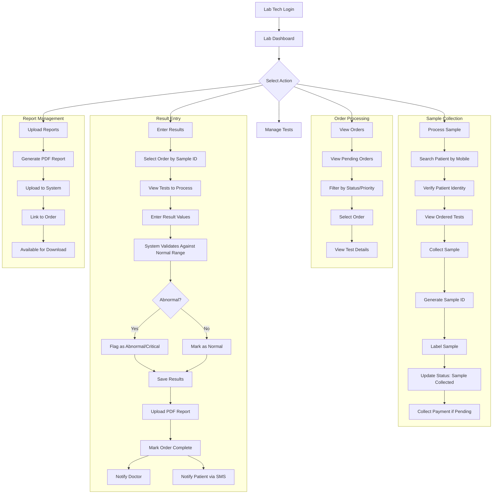
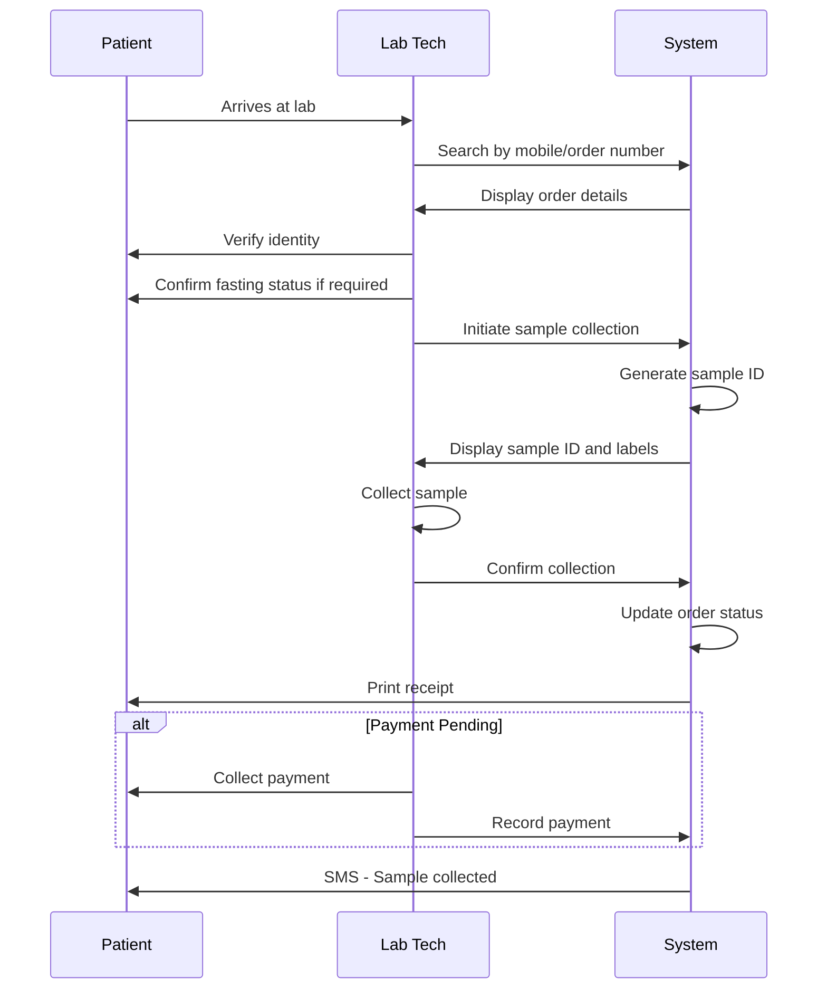
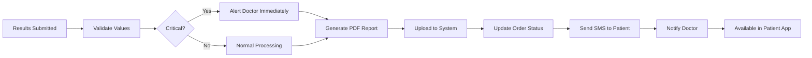

# Lab Module Specification

## Overview

The Lab Module manages diagnostic test orders, sample collection, result processing, and report generation. Lab technicians use this portal to view test orders from doctors, collect samples, enter test results, upload PDF reports, and notify patients and doctors when results are ready.

---

## Role-Based Access Control

| Permission | Access Level |
|------------|--------------|
| View lab orders | Full |
| Update order status | Full |
| Enter test results | Full |
| Upload reports | Full |
| View test catalog | Full |
| Manage test master | Full |
| View patient history | Read-only |
| Generate reports | Full |

---

## User Journey Flow



---

## Feature Specifications

### 1. Lab Dashboard

#### 1.1 Dashboard Components

| Component | Description | Data Source |
|-----------|-------------|-------------|
| Pending Orders | Orders awaiting sample collection | `lab_orders` |
| Samples Collected | Orders ready for processing | `lab_orders` |
| Results Pending | Orders with results to enter | `lab_order_items` |
| Completed Today | Finished orders | `lab_orders` |
| Critical Alerts | Abnormal results pending review | `lab_order_items` |
| Revenue Today | Lab collections | `payments` |

#### 1.2 Dashboard Stats API

```
GET /api/lab/dashboard-stats
```

Response:
```json
{
  "success": true,
  "data": {
    "pendingOrders": 15,
    "samplesCollected": 8,
    "resultsPending": 5,
    "completedToday": 12,
    "criticalAlerts": 2,
    "todayRevenue": 45000
  }
}
```

---

### 2. Lab Order Management

#### 2.1 Order List View

**Order Status Types:**
| Status | Description | Color |
|--------|-------------|-------|
| Pending | Order placed, awaiting sample | Grey |
| Sample Collected | Sample received, processing | Blue |
| In Progress | Tests being performed | Yellow |
| Completed | All results entered | Green |
| Cancelled | Order cancelled | Red |

**Order List Display:**
| Order # | Patient | Doctor | Tests | Status | Priority | Time | Actions |
|---------|---------|--------|-------|--------|----------|------|---------|
| LAB-001234 | John Doe | Dr. Kumar | 3 | Pending | Normal | 10:30 | [Collect Sample] |
| LAB-001235 | Sarah W | Dr. Singh | 2 | Sample Collected | Urgent | 10:15 | [Enter Results] |
| LAB-001236 | Mike C | Dr. Patel | 5 | In Progress | STAT | 09:45 | [Continue] |
| LAB-001237 | Emily B | Dr. Kumar | 1 | Completed | Normal | 09:00 | [View Report] |

**Priority Types:**
| Priority | Description | Turnaround |
|----------|-------------|------------|
| Normal | Standard processing | 24-48 hours |
| Urgent | Priority processing | 6-12 hours |
| STAT | Emergency, immediate | 1-2 hours |

**API Endpoint:**
```
GET /api/lab/orders?status=pending&priority=urgent
GET /api/lab/orders/:id
```

#### 2.2 Order Detail View

**Order Details:**
```
┌─────────────────────────────────────────────────────┐
│  LAB ORDER: LAB-001234                              │
│  Status: Pending | Priority: Normal                 │
├─────────────────────────────────────────────────────┤
│  PATIENT INFORMATION                                │
│  Name: John Doe                                     │
│  Patient ID: PT-001234                              │
│  Mobile: 9876543210                                 │
│  Age/Gender: 35 / Male                              │
│                                                     │
│  ORDERED BY                                         │
│  Dr. Rajesh Kumar (Cardiology)                      │
│  Date: 01-Mar-2026 10:30 AM                         │
│  Clinical Notes: Fasting sample required            │
├─────────────────────────────────────────────────────┤
│  TESTS ORDERED                                      │
│  ┌─────────────────────────────────────────────┐   │
│  │ 1. Complete Blood Count (CBC)               │   │
│  │    Code: CBC | Price: ₹300                  │   │
│  │    Turnaround: 24 hours                     │   │
│  │    Status: Pending                          │   │
│  └─────────────────────────────────────────────┘   │
│  ┌─────────────────────────────────────────────┐   │
│  │ 2. Lipid Profile                            │   │
│  │    Code: LIPID | Price: ₹700                │   │
│  │    Turnaround: 24 hours                     │   │
│  │    Status: Pending                          │   │
│  └─────────────────────────────────────────────┘   │
│  ┌─────────────────────────────────────────────┐   │
│  │ 3. Fasting Blood Sugar                      │   │
│  │    Code: FBS | Price: ₹150                  │   │
│  │    Turnaround: 6 hours                      │   │
│  │    Status: Pending                          │   │
│  └─────────────────────────────────────────────┘   │
├─────────────────────────────────────────────────────┤
│  BILLING                                            │
│  Total Amount: ₹1,150                               │
│  Payment Status: Paid                               │
│                                                     │
│  [Collect Sample] [Print Labels] [Cancel Order]    │
└─────────────────────────────────────────────────────┘
```

**API Endpoint:**
```
GET /api/lab/orders/:id/details
```

---

### 3. Sample Collection

#### 3.1 Sample Collection Workflow



#### 3.2 Sample Collection Form

**Collection Details:**
| Field | Type | Required |
|-------|------|----------|
| Sample ID | Auto-generated | Yes |
| Collection Time | Auto-timestamp | Yes |
| Sample Type | Select | Yes |
| Fasting Status | Checkbox | Conditional |
| Collected By | Auto (logged user) | Yes |
| Notes | Text | No |

**Sample Types:**
| Sample Type | Common Tests |
|-------------|--------------|
| Blood - Venous | CBC, LFT, KFT, Lipid |
| Blood - Finger Prick | Glucose, HbA1c |
| Urine - Random | Urinalysis |
| Urine - 24hr | Protein, Creatinine |
| Stool | Occult blood, Parasites |
| Swab | Culture, COVID |
| Sputum | TB, Culture |

#### 3.3 Sample Label Generation

**Label Format:**
```
┌─────────────────────────────────┐
│ SAMPLE ID: SPL-2026-000123      │
│ Patient: John Doe               │
│ Patient ID: PT-001234           │
│ DOB: 15-May-1990                │
│ ─────────────────────────────── │
│ Tests: CBC, Lipid Profile, FBS  │
│ Collected: 01-Mar-2026 10:45    │
│ Sample Type: Blood - Venous     │
│ ─────────────────────────────── │
│ ⚠ Fasting Sample                │
└─────────────────────────────────┘
```

**API Endpoints:**
```
POST /api/lab/orders/:id/collect-sample
GET  /api/lab/orders/:id/labels
```

**Collect Sample Request:**
```json
{
  "orderId": "uuid",
  "sampleType": "Blood - Venous",
  "fastingStatus": true,
  "collectionNotes": "Patient confirmed 12-hour fast"
}
```

---

### 4. Result Entry

#### 4.1 Result Entry Interface

**Tests to Process:**
| Test | Status | Normal Range | Actions |
|------|--------|--------------|---------|
| CBC | Pending | - | [Enter Results] |
| Lipid Profile | Pending | - | [Enter Results] |
| FBS | Pending | 70-100 mg/dL | [Enter Results] |

**Result Entry Form:**
```
┌─────────────────────────────────────────────────────┐
│  ENTER RESULTS - Complete Blood Count (CBC)         │
│  Patient: John Doe | Sample: SPL-2026-000123        │
├─────────────────────────────────────────────────────┤
│  PARAMETER          │ RESULT │ UNIT │ NORMAL RANGE │
├─────────────────────────────────────────────────────┤
│  Hemoglobin         │ [13.5] │ g/dL │ 13.0-17.0    │
│  RBC Count          │ [4.8]  │ m/cmm│ 4.5-5.5      │
│  WBC Count          │ [7200] │ /cmm │ 4000-10000   │
│  Platelet Count     │ [250]  │ K/cmm│ 150-400      │
│  Hematocrit (HCT)   │ [42]   │ %    │ 38-50        │
│  MCV                │ [88]   │ fL   │ 80-100       │
│  MCH                │ [28]   │ pg   │ 27-33        │
│  MCHC               │ [32]   │ g/dL │ 32-36        │
├─────────────────────────────────────────────────────┤
│  Status: ✓ All values within normal range          │
│                                                     │
│  Technician Notes:                                  │
│  ┌─────────────────────────────────────────────┐   │
│  │ Sample quality good, no hemolysis           │   │
│  └─────────────────────────────────────────────┘   │
│                                                     │
│  [Save Draft] [Submit Results]                      │
└─────────────────────────────────────────────────────┘
```

#### 4.2 Result Validation

**Automatic Validation:**
| Condition | Action |
|-----------|--------|
| Within range | Mark as Normal (🟢) |
| Slightly abnormal | Mark as Abnormal (🟠) |
| Critically abnormal | Mark as Critical (🔴) + Alert |

**Abnormal Value Display:**
```
┌─────────────────────────────────────────────────────┐
│  ⚠️ ABNORMAL VALUES DETECTED                        │
├─────────────────────────────────────────────────────┤
│  PARAMETER          │ RESULT │ NORMAL    │ STATUS  │
├─────────────────────────────────────────────────────┤
│  Fasting Glucose    │  145   │ 70-100    │ 🟠 High │
│  HbA1c              │  8.2   │ <6.5      │ 🔴 Crit │
│  Cholesterol        │  245   │ <200      │ 🟠 High │
│  LDL                │  160   │ <100      │ 🟠 High │
├─────────────────────────────────────────────────────┤
│  🔴 CRITICAL: HbA1c = 8.2%                          │
│  Action: Notify doctor immediately                  │
│  [Acknowledge] [Notify Doctor] [Override]          │
└─────────────────────────────────────────────────────┘
```

#### 4.3 Result Entry API

**Submit Results:**
```
POST /api/lab/orders/:id/results
```

Request:
```json
{
  "orderId": "uuid",
  "results": [
    {
      "testId": "uuid",
      "resultValue": "145",
      "unit": "mg/dL",
      "referenceRange": "70-100",
      "interpretation": "High",
      "status": "abnormal"
    },
    {
      "testId": "uuid",
      "resultValue": "8.2",
      "unit": "%",
      "referenceRange": "<6.5",
      "interpretation": "Critical",
      "status": "critical"
    }
  ],
  "technicianNotes": "Sample quality good"
}
```

**Response:**
```json
{
  "success": true,
  "data": {
    "orderId": "uuid",
    "status": "completed",
    "criticalAlerts": [
      {
        "test": "HbA1c",
        "value": "8.2%",
        "normalRange": "<6.5%"
      }
    ],
    "notificationsSent": ["doctor", "patient"]
  }
}
```

---

### 5. Report Generation & Upload

#### 5.1 PDF Report Format

**Report Layout:**
```
┌─────────────────────────────────────────────────────────────┐
│                    CITY HOSPITAL LABORATORY                  │
│              NABL Accredited | ISO 9001:2015                 │
│         Address | Phone | Email | Website                    │
├─────────────────────────────────────────────────────────────┤
│  PATIENT DETAILS                                             │
│  Name: John Doe              Patient ID: PT-001234           │
│  Age/Gender: 35 / Male       Mobile: 9876543210              │
│  Referred By: Dr. Rajesh Kumar (Cardiology)                  │
├─────────────────────────────────────────────────────────────┤
│  REPORT DETAILS                                              │
│  Report No: LAB-2026-000123      Date: 01-Mar-2026           │
│  Sample ID: SPL-2026-000123      Collected: 01-Mar 10:45     │
│  Reported: 01-Mar-2026 14:30                                 │
├─────────────────────────────────────────────────────────────┤
│  COMPLETE BLOOD COUNT (CBC)                                  │
├─────────────────────────────────────────────────────────────┤
│  Test              │ Result │ Unit  │ Reference  │ Status   │
├─────────────────────────────────────────────────────────────┤
│  Hemoglobin        │  13.5  │ g/dL  │ 13.0-17.0  │  Normal  │
│  RBC Count         │   4.8  │ m/cmm │ 4.5-5.5    │  Normal  │
│  WBC Count         │  7200  │ /cmm  │ 4000-10000 │  Normal  │
│  Platelet Count    │   250  │ K/cmm │ 150-400    │  Normal  │
├─────────────────────────────────────────────────────────────┤
│  FASTING BLOOD SUGAR                                        │
├─────────────────────────────────────────────────────────────┤
│  Test              │ Result │ Unit  │ Reference  │ Status   │
├─────────────────────────────────────────────────────────────┤
│  Fasting Glucose   │   145  │ mg/dL │ 70-100     │ ⚠ High   │
├─────────────────────────────────────────────────────────────┤
│  LIPID PROFILE                                               │
├─────────────────────────────────────────────────────────────┤
│  Test              │ Result │ Unit  │ Reference  │ Status   │
├─────────────────────────────────────────────────────────────┤
│  Total Cholesterol │   245  │ mg/dL │ <200       │ ⚠ High   │
│  Triglycerides     │   180  │ mg/dL │ <150       │ ⚠ High   │
│  HDL Cholesterol   │    42  │ mg/dL │ >40        │  Normal  │
│  LDL Cholesterol   │   160  │ mg/dL │ <100       │ ⚠ High   │
│  VLDL              │    36  │ mg/dL │ <30        │ ⚠ High   │
├─────────────────────────────────────────────────────────────┤
│  REMARKS:                                                   │
│  Abnormal lipid profile. Elevated fasting glucose.          │
│  Please correlate clinically.                               │
│                                                             │
│  Technician: _____________  Pathologist: _____________      │
│                                                             │
│  This is a computer-generated report.                       │
│  For any queries, please contact the laboratory.            │
└─────────────────────────────────────────────────────────────┘
```

#### 5.2 Report Upload

**Upload Process:**
```
POST /api/lab/orders/:id/report
Content-Type: multipart/form-data
```

Request:
```
file: [PDF file]
orderId: uuid
reportType: final | provisional | corrected
```

**Response:**
```json
{
  "success": true,
  "data": {
    "reportId": "uuid",
    "reportUrl": "/reports/LAB-2026-000123.pdf",
    "uploadedAt": "2026-03-01T14:30:00Z"
  }
}
```

#### 5.3 Report Download

**API Endpoints:**
```
GET /api/lab/orders/:id/report
GET /api/lab/orders/:id/report/download
```

---

### 6. Test Catalog Management

#### 6.1 Test Master

**Test Information:**
| Field | Type | Required |
|-------|------|----------|
| Test Name | Text | Yes |
| Test Code | Text | Yes (Unique) |
| Category | Select | Yes |
| Sample Type | Select | Yes |
| Price | Number | Yes |
| Description | Text | No |
| Normal Range | Text | Yes |
| Unit | Text | Yes |
| Turnaround Hours | Number | Yes |
| Pre-test Instructions | Text | No |
| Active Status | Checkbox | Yes |

**Test Categories:**
| Category | Example Tests |
|----------|---------------|
| Hematology | CBC, ESR, Blood Group |
| Biochemistry | LFT, KFT, Lipid Profile |
| Diabetes | FBS, PPBS, HbA1c |
| Thyroid | T3, T4, TSH |
| Urine Analysis | Complete Urine, Microalbumin |
| Cardiac Markers | Troponin, CK-MB, BNP |
| Infectious Diseases | COVID, Dengue, Malaria |
| Hormones | Cortisol, Testosterone |

#### 6.2 Test API

```
GET  /api/lab/tests
GET  /api/lab/tests/:id
POST /api/lab/tests
PUT  /api/lab/tests/:id
DELETE /api/lab/tests/:id
```

**Create Test Request:**
```json
{
  "name": "Complete Blood Count",
  "code": "CBC",
  "category": "Hematology",
  "sampleType": "Blood - Venous",
  "price": 300,
  "description": "Complete blood count with differential",
  "normalRange": "Various - see report",
  "unit": "Various",
  "turnaroundHours": 24,
  "preTestInstructions": "No special preparation required"
}
```

---

### 7. Notifications

#### 7.1 Notification Events

| Event | Recipient | Channel | Template |
|-------|-----------|---------|----------|
| Sample Collected | Patient | SMS | "Your sample has been collected. Reports will be ready by [time]." |
| Results Ready | Patient | SMS + WhatsApp | "Your lab reports are ready. View in patient app or collect from lab." |
| Critical Results | Doctor | In-App + SMS | "CRITICAL: Lab results for [Patient] - [Test]: [Value]" |
| Report Downloaded | - | Log | Audit trail entry |

#### 7.2 Critical Alert to Doctor

**Alert Format:**
```json
{
  "event": "critical_lab_result",
  "data": {
    "patientId": "uuid",
    "patientName": "John Doe",
    "doctorId": "uuid",
    "orderNumber": "LAB-001234",
    "criticalTests": [
      {
        "test": "HbA1c",
        "value": "8.2%",
        "normalRange": "<6.5%"
      }
    ],
    "timestamp": "2026-03-01T14:30:00Z"
  }
}
```

---

### 8. Reports & Analytics

#### 8.1 Lab Reports

| Report | Description |
|--------|-------------|
| Daily Test Volume | Tests performed by category |
| Revenue Report | Daily/weekly/monthly revenue |
| TAT Compliance | Orders completed within turnaround time |
| Critical Results | Critical findings summary |
| Test-wise Analysis | Most ordered tests |

#### 8.2 TAT Compliance Report

| Test Category | Target TAT | Actual TAT | Compliance % |
|---------------|------------|------------|--------------|
| Hematology | 24 hrs | 18 hrs | 95% |
| Biochemistry | 24 hrs | 22 hrs | 88% |
| Urgent Orders | 6 hrs | 5 hrs | 92% |
| STAT Orders | 2 hrs | 1.5 hrs | 100% |

**API Endpoints:**
```
GET /api/lab/reports/daily-volume
GET /api/lab/reports/revenue
GET /api/lab/reports/tat-compliance
GET /api/lab/reports/critical-results
```

---

## UI Components Required

### Pages

| Page | Route | Description |
|------|-------|-------------|
| Dashboard | `/lab/dashboard` | Overview and stats |
| Orders | `/lab/orders` | Order list |
| Order Detail | `/lab/orders/:id` | Order information |
| Sample Collection | `/lab/collect/:id` | Collection form |
| Result Entry | `/lab/results/:id` | Enter test results |
| Reports | `/lab/reports` | View/upload reports |
| Test Catalog | `/lab/tests` | Manage tests |
| Analytics | `/lab/analytics` | Reports and stats |

### Components

| Component | Description |
|-----------|-------------|
| `OrderCard` | Order summary card |
| `SampleLabel` | Printable label |
| `ResultForm` | Test result entry |
| `ParameterRow` | Individual parameter input |
| `AbnormalAlert` | Critical value warning |
| `ReportPreview` | PDF preview |
| `TestSelector` | Multi-test selection |
| `StatusBadge` | Order status indicator |
| `TATIndicator` | Turnaround time display |

---

## Database Tables Used

| Table | Purpose |
|-------|---------|
| `lab_tests` | Test master data |
| `lab_orders` | Test orders |
| `lab_order_items` | Individual test results |
| `patients` | Patient info |
| `users` | Doctor/Lab tech info |
| `consultations` | Related consultation |
| `bills` | Lab billing |
| `payments` | Payment records |
| `notifications` | Alerts |

---

## Integration Points

| Module | Integration Type |
|--------|------------------|
| Doctor Module | Receive orders, send results |
| Patient Module | View reports |
| Billing Module | Payment processing |
| Notification Service | SMS/WhatsApp alerts |
| File Storage | PDF report storage |

---

## API Endpoints Summary

### Dashboard
```
GET /api/lab/dashboard-stats
```

### Orders
```
GET  /api/lab/orders
GET  /api/lab/orders/:id
GET  /api/lab/orders/:id/details
POST /api/lab/orders/:id/collect-sample
PUT  /api/lab/orders/:id/status
```

### Results
```
POST /api/lab/orders/:id/results
GET  /api/lab/orders/:id/results
PUT  /api/lab/results/:id
```

### Reports
```
GET  /api/lab/orders/:id/report
GET  /api/lab/orders/:id/report/download
POST /api/lab/orders/:id/report
```

### Tests
```
GET  /api/lab/tests
GET  /api/lab/tests/:id
POST /api/lab/tests
PUT  /api/lab/tests/:id
DELETE /api/lab/tests/:id
```

### Analytics
```
GET /api/lab/reports/daily-volume
GET /api/lab/reports/revenue
GET /api/lab/reports/tat-compliance
```

---

## Implementation Priority

| Priority | Feature | Dependencies |
|----------|---------|--------------|
| P0 | View Orders | Order system |
| P0 | Sample Collection | None |
| P0 | Result Entry | None |
| P1 | Report Generation | PDF library |
| P1 | Report Upload | File storage |
| P1 | Notifications | SMS/WhatsApp |
| P2 | Test Catalog Management | None |
| P2 | Analytics | All features |
| P3 | TAT Tracking | Order timestamps |

---

## System Actions

### When Results Completed



### Sample Collection Flow

```
1. Lab tech searches patient
2. Verifies patient identity
3. Confirms fasting status if required
4. Generates sample ID
5. Collects sample
6. Labels sample
7. Updates order status
8. Prints receipt for patient
9. Patient receives SMS confirmation
```

---

## Notes for Development

1. **Barcode Integration**: Support barcode scanners for sample ID entry
2. **Instrument Integration**: Auto-import results from lab analyzers (future)
3. **Quality Control**: Track QC samples and instrument calibration
4. **Audit Trail**: Log all result changes with reason
5. **Digital Signature**: Pathologist digital signature on reports
6. **Report Templates**: Customizable report formats by test type
7. **Batch Processing**: Process multiple orders together
8. **Reference Ranges**: Age/gender-specific normal ranges
9. **Delta Check**: Alert if results differ significantly from previous
10. **Interfacing**: HL7/FHIR support for hospital integration (future)
