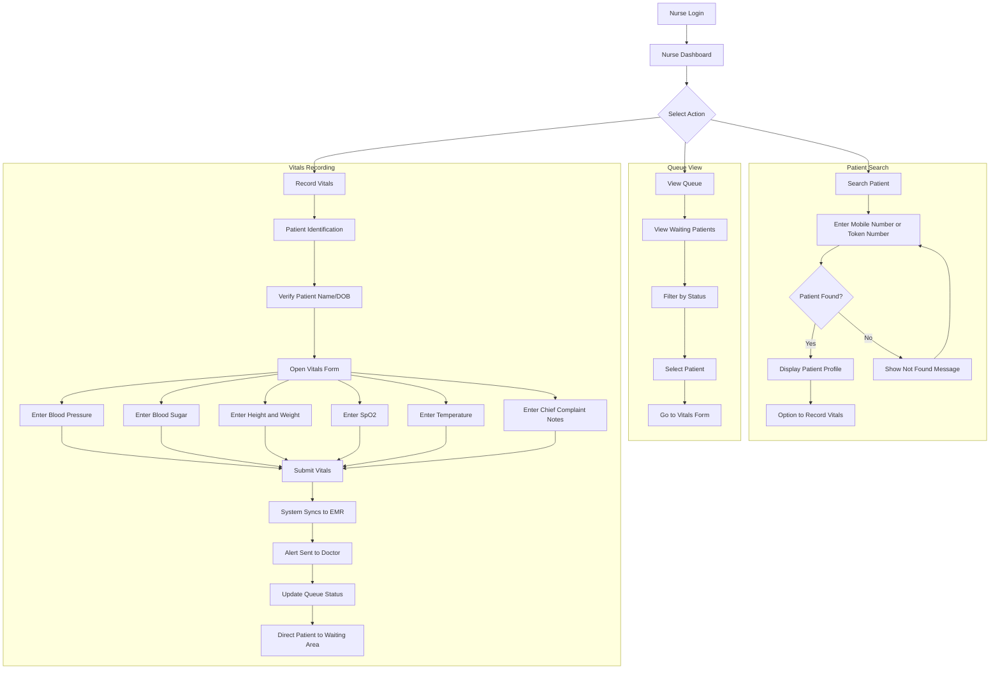
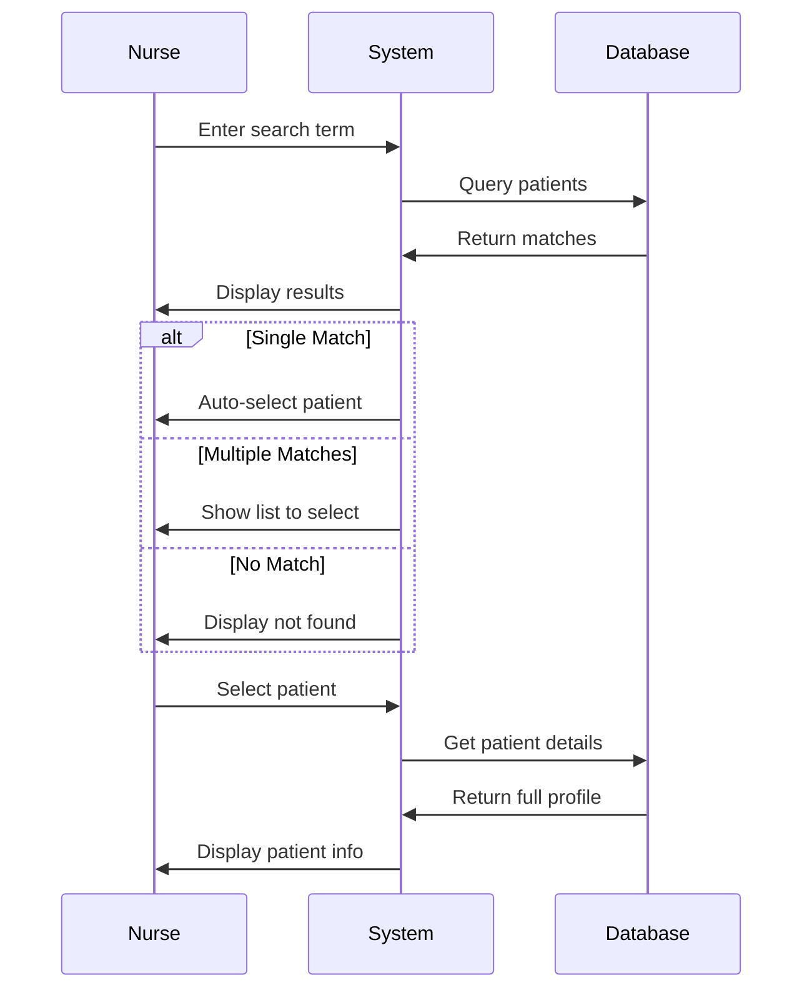
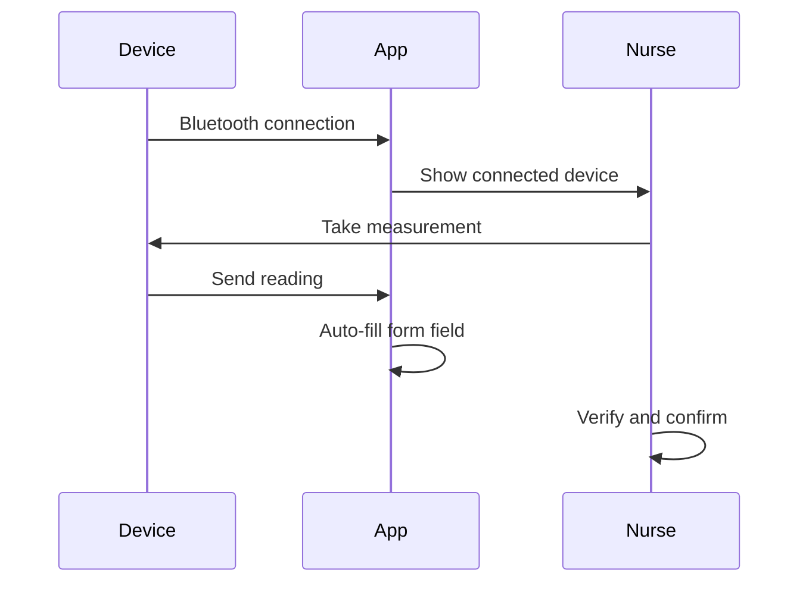

# Nurse Module Specification

## Overview

The Nurse Module handles the triage and vitals collection phase of the patient journey. Nurses use this portal to search for patients, record vital signs, capture chief complaints, and update patient records. The vitals data entered by nurses becomes immediately available to doctors during consultation.

---

## Role-Based Access Control

| Permission | Access Level |
|------------|--------------|
| Search patients | Full |
| View patient demographics | Full |
| View patient medical history | Read-only |
| Record vitals | Full |
| Edit own vitals entries | Limited (within 30 min) |
| View appointments | Read-only |
| View queue status | Full |
| Access prescriptions | Read-only |

---

## User Journey Flow



---

## Feature Specifications

### 1. Nurse Dashboard

#### 1.1 Dashboard Components

| Component | Description | Data Source |
|-----------|-------------|-------------|
| Today's Queue | Patients waiting for vitals | `queue_entries` |
| Vitals Completed | Count of patients processed | `vitals` |
| Pending Vitals | Patients yet to be processed | `queue_entries` |
| Quick Search | Search by mobile/token | - |
| Recent Activity | Last 10 vitals recorded | `vitals` |

#### 1.2 Dashboard Stats API

```
GET /api/nurse/dashboard-stats
```

Response:
```json
{
  "success": true,
  "data": {
    "totalPatients": 45,
    "vitalsCompleted": 28,
    "pendingVitals": 17,
    "recentVitals": [
      {
        "id": "uuid",
        "patientName": "John Doe",
        "tokenNumber": 12,
        "recordedAt": "2026-03-01T10:30:00Z"
      }
    ]
  }
}
```

---

### 2. Patient Search

#### 2.1 Search Interface

**Search Options:**
| Search By | Format | Example |
|-----------|--------|---------|
| Mobile Number | 10 digits | 9876543210 |
| Token Number | Numeric | 12 |
| Patient ID | PT-XXXXXX | PT-001234 |
| Patient Name | Text | John Doe |

**Search Flow:**


**API Endpoints:**
```
GET /api/nurse/patients/search?mobile=9876543210
GET /api/nurse/patients/search?token=12
GET /api/nurse/patients/search?name=John
```

**Search Response:**
```json
{
  "success": true,
  "data": {
    "patients": [
      {
        "id": "uuid",
        "patientNumber": "PT-001234",
        "firstName": "John",
        "lastName": "Doe",
        "phone": "9876543210",
        "gender": "male",
        "dateOfBirth": "1990-05-15",
        "tokenNumber": 12,
        "queueStatus": "waiting"
      }
    ]
  }
}
```

#### 2.2 Patient Profile View

**Display Information:**
| Section | Fields |
|---------|--------|
| Demographics | Name, Age, Gender, Phone |
| Today's Visit | Token #, Doctor, Appointment Time |
| Pre-existing Conditions | Diabetes, Hypertension, etc. |
| Allergies | Known allergies list |
| Current Medications | Active prescriptions |
| Previous Vitals | Last recorded vitals |

**API Endpoint:**
```
GET /api/nurse/patients/:id/profile
```

---

### 3. Vitals Recording

#### 3.1 Vitals Form

**Vital Signs Fields:**

| Field | Type | Unit | Normal Range | Required |
|-------|------|------|--------------|----------|
| Blood Pressure (Systolic) | Number | mmHg | 90-120 | Yes |
| Blood Pressure (Diastolic) | Number | mmHg | 60-80 | Yes |
| Heart Rate | Number | bpm | 60-100 | Yes |
| Temperature | Number | °F or °C | 97-99°F | Yes |
| Weight | Number | kg | - | Yes |
| Height | Number | cm | - | No |
| BMI | Auto-calculated | kg/m² | 18.5-24.9 | Auto |
| Blood Sugar (Fasting) | Number | mg/dL | 70-100 | No |
| Blood Sugar (Random) | Number | mg/dL | <140 | No |
| Blood Sugar (Post Meal) | Number | mg/dL | <180 | No |
| SpO2 (Oxygen Saturation) | Number | % | 95-100 | Yes |
| Respiratory Rate | Number | breaths/min | 12-20 | No |
| Chief Complaint Notes | Textarea | - | - | Yes |

#### 3.2 Vitals Form UI

```
┌─────────────────────────────────────────────────────┐
│  RECORD VITALS                                      │
│  Patient: John Doe          Token: #12              │
│  Doctor: Dr. Rajesh Kumar   Time: 10:30 AM          │
├─────────────────────────────────────────────────────┤
│                                                     │
│  BLOOD PRESSURE                                     │
│  ┌─────────┐    ┌─────────┐                        │
│  │ Systolic│    │Diastolic│                        │
│  │  [120]  │ /  │  [80]   │ mmHg                   │
│  └─────────┘    └─────────┘                        │
│  Status: ✓ Normal                                  │
│                                                     │
│  VITAL SIGNS                                        │
│  ┌──────────────────┐  ┌──────────────────┐        │
│  │ Heart Rate       │  │ Temperature      │        │
│  │    [72] bpm      │  │   [98.6] °F      │        │
│  └──────────────────┘  └──────────────────┘        │
│  ┌──────────────────┐  ┌──────────────────┐        │
│  │ SpO2             │  │ Respiratory Rate │        │
│  │    [98] %        │  │    [16] /min     │        │
│  └──────────────────┘  └──────────────────┘        │
│                                                     │
│  BODY MEASUREMENTS                                  │
│  ┌──────────────────┐  ┌──────────────────┐        │
│  │ Weight           │  │ Height           │        │
│  │    [70] kg       │  │   [175] cm       │        │
│  └──────────────────┘  └──────────────────┘        │
│  BMI: 22.9 (Normal)                                │
│                                                     │
│  BLOOD SUGAR (Optional)                             │
│  ○ Fasting  [___] mg/dL                            │
│  ○ Random  [___] mg/dL                             │
│  ○ Post Meal [___] mg/dL                           │
│                                                     │
│  CHIEF COMPLAINT                                    │
│  ┌─────────────────────────────────────────────┐   │
│  │ Patient complains of chest pain and         │   │
│  │ shortness of breath for the past 2 days...  │   │
│  └─────────────────────────────────────────────┘   │
│                                                     │
│  [Cancel]                    [Save Vitals]          │
└─────────────────────────────────────────────────────┘
```

#### 3.3 Abnormal Value Alerts

**Alert Thresholds:**

| Vital | Low Alert | High Alert | Critical Low | Critical High |
|-------|-----------|------------|--------------|---------------|
| BP Systolic | <90 | >140 | <80 | >180 |
| BP Diastolic | <60 | >90 | <50 | >120 |
| Heart Rate | <60 | >100 | <50 | >150 |
| Temperature | <97°F | >100°F | <95°F | >103°F |
| SpO2 | <95% | - | <90% | - |
| Blood Sugar | <70 | >140 | <50 | >400 |

**Alert Display:**
- ⚠️ Yellow: Slightly abnormal - Continue
- 🔴 Red: Critical - Alert doctor immediately

#### 3.4 Vitals API

**Create Vitals:**
```
POST /api/vitals
```

Request:
```json
{
  "patientId": "uuid",
  "appointmentId": "uuid",
  "bloodPressureSystolic": 120,
  "bloodPressureDiastolic": 80,
  "heartRate": 72,
  "temperature": 98.6,
  "weight": 70,
  "height": 175,
  "bmi": 22.9,
  "bloodSugarFasting": null,
  "bloodSugarRandom": 110,
  "oxygenSaturation": 98,
  "respiratoryRate": 16,
  "notes": "Patient complains of chest pain and shortness of breath"
}
```

Response:
```json
{
  "success": true,
  "data": {
    "id": "uuid",
    "patientId": "uuid",
    "recordedAt": "2026-03-01T10:35:00Z",
    "alerts": []
  }
}
```

**Get Vitals:**
```
GET /api/vitals/patient/:patientId
GET /api/vitals/:id
```

**Update Vitals (within 30 min):**
```
PUT /api/vitals/:id
```

---

### 4. Queue Integration

#### 4.1 Queue View for Nurses

**Features:**
- See patients waiting for vitals
- Filter by status (waiting, vitals done)
- Sort by token number or wait time
- Quick action to start vitals

**Queue List:**
| Token | Patient | Age | Doctor | Wait Time | Status | Actions |
|-------|---------|-----|--------|-----------|--------|---------|
| 12 | John Doe | 35 | Dr. Kumar | 15 min | Waiting | [Record Vitals] |
| 13 | Sarah W | 28 | Dr. Kumar | 10 min | Waiting | [Record Vitals] |
| 14 | Mike C | 45 | Dr. Singh | 5 min | Vitals Done | [View] |
| 15 | Emily B | 52 | Dr. Singh | 2 min | Waiting | [Record Vitals] |

**API Endpoint:**
```
GET /api/nurse/queue
```

#### 4.2 Queue Status Update

**After Vitals Recorded:**
- Update patient queue status to "vitals-done"
- Notify doctor that patient is ready
- Patient directed to waiting area

**Status Flow:**
```
waiting → vitals-in-progress → vitals-done → with-doctor → completed
```

**API Endpoint:**
```
PUT /api/nurse/queue/:id/status
```

---

### 5. Medical History Access

#### 5.1 Previous Vitals View

**Features:**
- View patient's previous vitals
- Trend visualization
- Compare current vs previous

**Previous Vitals Display:**
| Date | BP | Pulse | Temp | Weight | SpO2 | Recorded By |
|------|-----|-------|------|--------|------|-------------|
| 01-Mar | 120/80 | 72 | 98.6°F | 70kg | 98% | Nurse A |
| 15-Feb | 118/78 | 70 | 98.4°F | 71kg | 99% | Nurse B |
| 01-Feb | 122/82 | 74 | 98.8°F | 70kg | 98% | Nurse A |

**API Endpoint:**
```
GET /api/nurse/patients/:patientId/vitals-history
```

#### 5.2 Pre-existing Conditions View

**Display:**
| Condition | Diagnosed | Status | Notes |
|-----------|-----------|--------|-------|
| Hypertension | Jan 2024 | Active | On medication |
| Diabetes Type 2 | Mar 2023 | Controlled | Diet managed |

---

### 6. Notifications

#### 6.1 Doctor Notification

**When Vitals Recorded:**
- Real-time notification to assigned doctor
- Update in doctor's queue view
- Vitals visible in consultation form

**Notification Event:**
```json
{
  "event": "vitals_recorded",
  "data": {
    "patientId": "uuid",
    "patientName": "John Doe",
    "tokenNumber": 12,
    "doctorId": "uuid",
    "hasAlerts": false,
    "vitalsSummary": {
      "bp": "120/80",
      "pulse": 72,
      "temp": "98.6°F",
      "spo2": "98%"
    }
  }
}
```

---

## UI Components Required

### Pages

| Page | Route | Description |
|------|-------|-------------|
| Dashboard | `/nurse/dashboard` | Overview and quick actions |
| Patient Search | `/nurse/search` | Find patients |
| Record Vitals | `/nurse/vitals/:patientId` | Vitals entry form |
| Patient Profile | `/nurse/patient/:id` | Patient details |
| Queue | `/nurse/queue` | Patient queue view |
| History | `/nurse/history` | Today's recorded vitals |

### Components

| Component | Description |
|-----------|-------------|
| `QuickSearch` | Mobile/token search bar |
| `PatientCard` | Patient info summary |
| `VitalsForm` | Vitals entry form |
| `BPInput` | Blood pressure dual input |
| `VitalsAlert` | Abnormal value warning |
| `QueueList` | Waiting patients list |
| `VitalsHistory` | Previous vitals table |
| `TrendChart` | Vitals trend visualization |

---

## Database Tables Used

| Table | Purpose |
|-------|---------|
| `vitals` | Store recorded vitals |
| `patients` | Patient demographics |
| `queue_entries` | Queue status |
| `appointments` | Today's appointments |
| `medical_history` | Pre-existing conditions |
| `users` | Nurse profile |
| `notifications` | Doctor alerts |

---

## Integration Points

| Module | Integration Type |
|--------|------------------|
| Patient Module | Read patient data |
| Doctor Module | Push vitals data |
| Queue System | Update status |
| Notification Service | Alert doctors |

---

## API Endpoints Summary

### Dashboard
```
GET /api/nurse/dashboard-stats
```

### Patient Search
```
GET /api/nurse/patients/search
GET /api/nurse/patients/:id/profile
GET /api/nurse/patients/:id/vitals-history
```

### Vitals
```
POST /api/vitals
GET  /api/vitals/patient/:patientId
GET  /api/vitals/:id
PUT  /api/vitals/:id
```

### Queue
```
GET /api/nurse/queue
PUT /api/nurse/queue/:id/status
```

---

## Implementation Priority

| Priority | Feature | Dependencies |
|----------|---------|--------------|
| P0 | Patient Search | Patient module |
| P0 | Vitals Recording Form | None |
| P0 | Queue Integration | Queue system |
| P1 | Dashboard | All features |
| P1 | Abnormal Value Alerts | Vitals thresholds |
| P2 | Vitals History | Historical data |
| P2 | Trend Visualization | Charts library |

---

## Equipment Integration (Future)

### Potential Integrations

| Device | Connection | Data |
|--------|------------|------|
| Digital BP Monitor | Bluetooth/USB | BP, Pulse |
| Pulse Oximeter | Bluetooth | SpO2, Pulse |
| Digital Thermometer | Bluetooth | Temperature |
| Weighing Scale | Bluetooth/USB | Weight |
| Glucometer | Bluetooth | Blood Sugar |

### Auto-Capture Flow


---

## Notes for Development

1. **Mobile-First**: Nurses often use tablets; design for touch
2. **Quick Entry**: Minimize typing; use numeric keypads
3. **Validation**: Real-time validation with normal range indicators
4. **Offline Support**: Cache patient list for offline access
5. **Auto-Save**: Save draft vitals every 30 seconds
6. **Keyboard Navigation**: Support tab navigation for desktop
7. **Accessibility**: Large fonts, high contrast for clinical environment
8. **Audit Trail**: Log all vitals entries with timestamp and nurse ID
