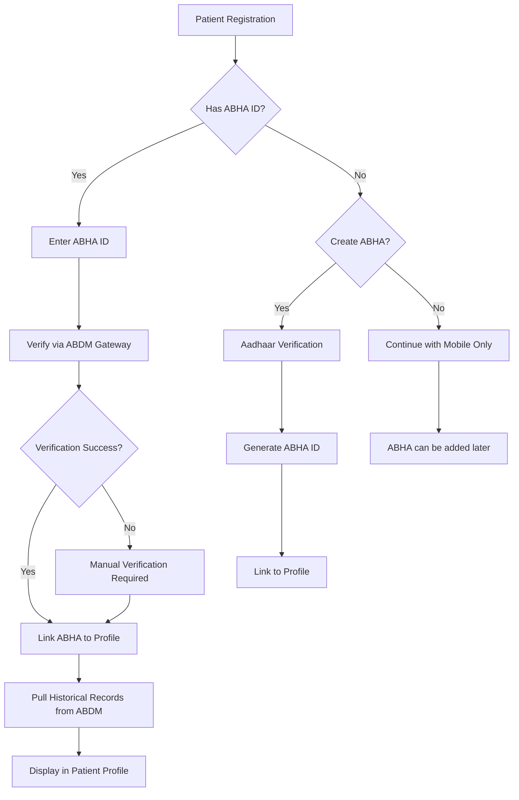
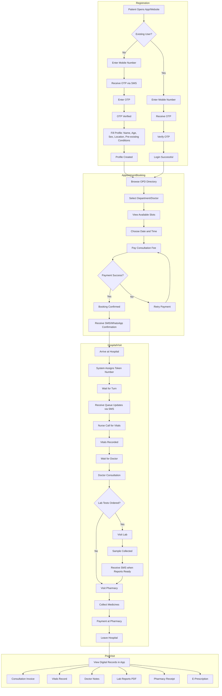
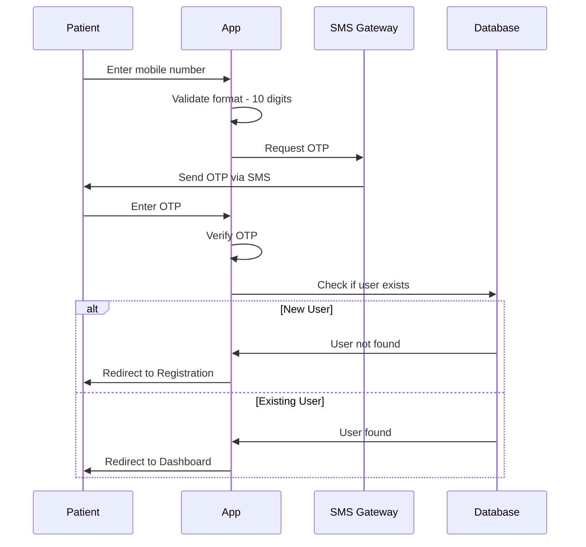
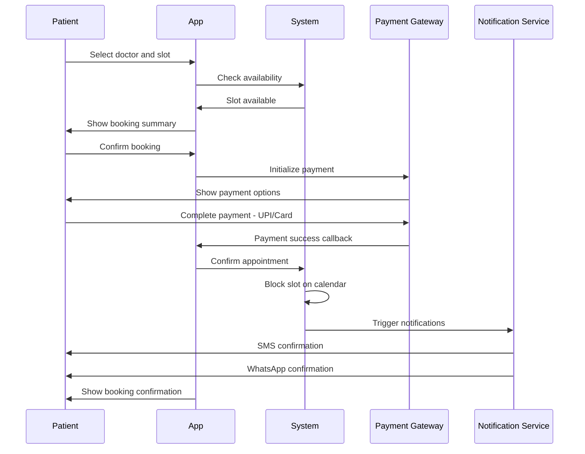
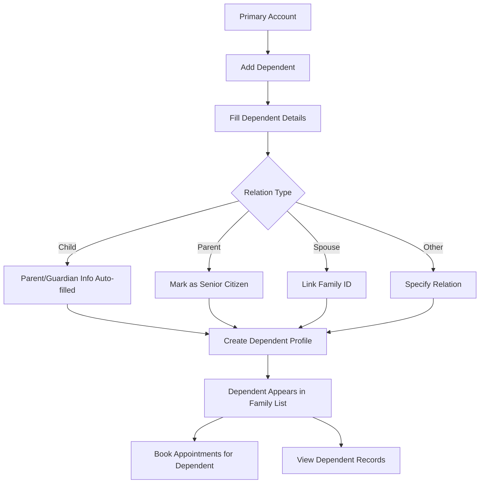

# Patient Module Specification

## Overview

The Patient Module provides the patient-facing interface for the HMS. It supports two primary access methods: Online Self-Service (mobile app/web) and Walk-in (via Front Desk). The module handles patient registration, OTP verification, **ABHA ID integration (ABDM compliance)**, appointment booking, payment processing, queue tracking, access to medical records, and post-visit documentation.

---

## ABDM Compliance (Ayushman Bharat Digital Mission)

### ABHA ID Integration

The Ayushman Bharat Health Account (ABHA) ID is a unique 14-digit identifier that enables patients to access and share their health records across healthcare providers in India. ABDM compliance is **mandatory** for modern HMS implementations in India.

#### ABHA Registration Flow



#### ABHA Features

| Feature | Description |
|---------|-------------|
| ABHA ID | 14-digit unique identifier (e.g., 91-1234-5678-9012) |
| ABHA Address | PHR address for health records (e.g., patient@abdm) |
| Aadhaar Linking | Optional Aadhaar-based verification |
| Health Records | Pull records from other ABDM-linked hospitals |
| Consent Management | Patient controls data sharing permissions |

#### ABHA API Integration

**Verify ABHA ID:**
```
POST /api/patients/abha/verify
```

Request:
```json
{
  "abhaId": "91-1234-5678-9012"
}
```

Response:
```json
{
  "success": true,
  "data": {
    "abhaId": "91-1234-5678-9012",
    "abhaAddress": "john.doe@abdm",
    "name": "John Doe",
    "gender": "M",
    "yearOfBirth": "1990",
    "mobile": "9876543210",
    "isVerified": true
  }
}
```

**Create ABHA ID:**
```
POST /api/patients/abha/create
```

Request:
```json
{
  "aadhaarNumber": "encrypted_aadhaar",
  "mobileNumber": "9876543210",
  "otp": "123456"
}
```

**Link ABHA to Patient:**
```
POST /api/patients/:id/abha/link
```

**Fetch Health Records from ABDM:**
```
GET /api/patients/:id/abha/records
```

#### ABHA Data Model Addition

```prisma
model Patient {
  // ... existing fields
  abhaId              String?   @map("abha_id")
  abhaAddress         String?   @map("abha_address")
  abhaLinkedAt        DateTime? @map("abha_linked_at")
  abdmConsentId       String?   @map("abdm_consent_id")
}
```

---

## Role-Based Access Control

| Permission | Access Level |
|------------|--------------|
| View own profile | Full |
| Edit own profile | Full |
| Book appointment | Full |
| Cancel appointment | Limited (before 24 hours) |
| View own medical records | Full |
| View own prescriptions | Full |
| View own lab reports | Full |
| Download invoices | Full |
| Make payments | Full |
| View queue status | Full |

---

## User Journey Flow

### Complete Patient Lifecycle



---

## Feature Specifications

### 1. Authentication & Registration

#### 1.1 Mobile Number Verification (OTP)

**Features:**
- Mobile number as unique identifier
- OTP sent via SMS (primary) and WhatsApp (backup)
- OTP validity: 5 minutes
- Resend OTP after 60 seconds
- Maximum 3 attempts before cooldown

**OTP Flow:**


**API Endpoints:**
```
POST /api/auth/send-otp
POST /api/auth/verify-otp
POST /api/auth/resend-otp
```

**Send OTP Request:**
```json
{
  "mobileNumber": "9876543210",
  "countryCode": "+91"
}
```

**Verify OTP Request:**
```json
{
  "mobileNumber": "9876543210",
  "otp": "123456"
}
```

**Verify OTP Response:**
```json
{
  "success": true,
  "data": {
    "isNewUser": false,
    "user": {
      "id": "uuid",
      "firstName": "John",
      "lastName": "Doe",
      "phone": "9876543210"
    },
    "accessToken": "jwt_token",
    "refreshToken": "refresh_token"
  }
}
```

#### 1.2 Profile Registration

**Registration Form Fields:**

| Field | Type | Required | Validation |
|-------|------|----------|------------|
| First Name | Text | Yes | Min 2 chars |
| Last Name | Text | Yes | Min 2 chars |
| Mobile Number | Text | Yes | Pre-filled, Read-only |
| Email | Email | No | Valid email format |
| Date of Birth | Date | Yes | Not future date |
| Gender | Select | Yes | Male/Female/Other |
| Blood Group | Select | No | A+/A-/B+/B-/O+/O-/AB+/AB- |
| Address | Textarea | No | - |
| City | Text | No | - |
| State | Select | No | Indian states |
| Pincode | Text | No | 6 digits |
| Emergency Contact Name | Text | No | - |
| Emergency Contact Phone | Text | No | 10 digits |
| Pre-existing Conditions | Multi-select | No | List of conditions |
| Allergies | Multi-select | No | List of allergies |

**Pre-existing Conditions Options:**
- Diabetes
- Hypertension
- Heart Disease
- Asthma
- Thyroid Disorder
- Kidney Disease
- Cancer
- None
- Other (specify)

**API Endpoint:**
```
POST /api/patients/register
PUT  /api/patients/profile
GET  /api/patients/profile
```

**Registration Request:**
```json
{
  "firstName": "John",
  "lastName": "Doe",
  "phone": "9876543210",
  "email": "john.doe@email.com",
  "dateOfBirth": "1990-05-15",
  "gender": "male",
  "bloodGroup": "O+",
  "address": "123 Main Street",
  "city": "Mumbai",
  "state": "Maharashtra",
  "pincode": "400001",
  "emergencyContact": "Jane Doe",
  "emergencyPhone": "9876543211",
  "preExistingConditions": ["diabetes", "hypertension"],
  "allergies": ["penicillin"]
}
```

---

### 2. OPD Directory & Doctor Selection

#### 2.1 Browse Doctors

**Features:**
- Search by doctor name
- Filter by department/specialty
- Filter by availability (today, tomorrow, this week)
- Sort by rating, experience, fee
- View doctor profile with qualifications

**Doctor Card Display:**
| Element | Description |
|---------|-------------|
| Photo | Doctor's profile picture |
| Name | Dr. [First] [Last] |
| Specialty | Department name |
| Qualifications | Degrees displayed |
| Experience | Years of practice |
| Rating | Star rating (1-5) |
| Consultation Fee | In ₹ |
| Next Available | Earliest slot |
| Languages | Languages spoken |

**API Endpoint:**
```
GET /api/doctors?department=cardiology&date=2026-03-01
GET /api/doctors/:id
GET /api/doctors/:id/slots?date=2026-03-01
```

**Doctor List Response:**
```json
{
  "success": true,
  "data": {
    "doctors": [
      {
        "id": "uuid",
        "name": "Dr. Rajesh Kumar",
        "specialty": "Cardiology",
        "qualifications": "MBBS, MD, DM",
        "experience": 15,
        "rating": 4.8,
        "consultationFee": 500,
        "nextAvailable": "2026-03-01T10:00:00Z",
        "languages": ["Hindi", "English"],
        "photo": "url_to_photo"
      }
    ],
    "pagination": {
      "page": 1,
      "limit": 10,
      "total": 25
    }
  }
}
```

#### 2.2 View Available Slots

**Features:**
- Calendar view for date selection
- Time slots with availability status
- Blocked slots shown as unavailable
- Real-time slot updates

**Slot Display:**
| Time | Status | Action |
|------|--------|--------|
| 09:00 | Available | [Book] |
| 09:30 | Available | [Book] |
| 10:00 | Booked | - |
| 10:30 | Available | [Book] |
| 11:00 | Blocked | - |

**API Endpoint:**
```
GET /api/doctors/:id/slots?date=2026-03-01
```

**Slots Response:**
```json
{
  "success": true,
  "data": {
    "date": "2026-03-01",
    "doctorId": "uuid",
    "slots": [
      { "time": "09:00", "status": "available" },
      { "time": "09:30", "status": "available" },
      { "time": "10:00", "status": "booked" },
      { "time": "10:30", "status": "available" },
      { "time": "11:00", "status": "blocked" }
    ]
  }
}
```

---

### 3. Appointment Booking

#### 3.1 Booking Flow



#### 3.2 Booking Summary

**Before Payment:**
| Item | Details |
|------|---------|
| Doctor | Dr. Rajesh Kumar |
| Specialty | Cardiology |
| Date | March 1, 2026 |
| Time | 10:30 AM |
| Consultation Fee | ₹500 |
| Convenience Fee | ₹20 |
| **Total** | **₹520** |

#### 3.3 Payment Integration

**Payment Methods:**
| Method | Provider | Status |
|--------|----------|--------|
| UPI | Razorpay | Primary |
| Credit Card | Razorpay | Active |
| Debit Card | Razorpay | Active |
| Net Banking | Razorpay | Active |
| Wallet | Razorpay | Active |

**UPI Priority:**
- Default to UPI for Indian users
- Show UPI apps installed on device
- Support UPI ID and QR code

**Payment API:**
```
POST /api/payments/create-order
POST /api/payments/verify
POST /api/appointments
```

**Create Order Request:**
```json
{
  "amount": 520,
  "currency": "INR",
  "appointmentData": {
    "doctorId": "uuid",
    "patientId": "uuid",
    "date": "2026-03-01",
    "time": "10:30"
  }
}
```

**Create Order Response:**
```json
{
  "success": true,
  "data": {
    "orderId": "order_xyz123",
    "amount": 520,
    "currency": "INR",
    "key": "rzp_key",
    "prefill": {
      "name": "John Doe",
      "email": "john.doe@email.com",
      "contact": "9876543210"
    }
  }
}
```

#### 3.4 Booking Confirmation

**Confirmation Screen:**
| Element | Details |
|---------|---------|
| Booking ID | APT-2026030101 |
| Token Number | Will be assigned on arrival |
| Doctor | Dr. Rajesh Kumar |
| Date & Time | March 1, 2026 at 10:30 AM |
| Location | City Hospital, OPD Block, Room 105 |
| Amount Paid | ₹520 |
| Payment ID | pay_xyz123 |

**API Endpoint:**
```
POST /api/appointments
GET  /api/appointments/:id
GET  /api/appointments/my-appointments
DELETE /api/appointments/:id
```

**Create Appointment Request:**
```json
{
  "doctorId": "uuid",
  "patientId": "uuid",
  "appointmentDate": "2026-03-01T10:30:00Z",
  "type": "consultation",
  "paymentId": "pay_xyz123",
  "notes": "First visit for chest pain"
}
```

---

### 4. Queue Management (Patient View)

#### 4.1 Token Assignment

**When Patient Arrives:**
- System detects patient arrival (manual check-in or auto-detect)
- Token number assigned for the day
- Patient notified via SMS/WhatsApp

**Token Display:**
```
Your Token: #12
Current Serving: #8
Estimated Wait: ~20 minutes
```

#### 4.2 Real-Time Queue Updates

**Features:**
- Live queue position tracking
- Push notification when "You are next"
- Estimated wait time updates
- Queue status: Waiting, Next, In Progress

**Queue Status Screen:**
| Element | Display |
|---------|---------|
| Your Token | #12 |
| Status | Waiting |
| Position | 4th in queue |
| Current Token | #9 |
| Est. Wait | 15 minutes |
| Doctor | Dr. Rajesh Kumar |

**WebSocket Events:**
```javascript
// Queue update event
{
  "event": "queue_update",
  "data": {
    "tokenNumber": 12,
    "position": 3,
    "estimatedWait": 12,
    "currentServing": 10
  }
}

// You are next event
{
  "event": "you_are_next",
  "data": {
    "tokenNumber": 12,
    "message": "Please proceed to Room 105"
  }
}
```

**API Endpoints:**
```
GET /api/patient/queue-status
POST /api/patient/check-in
```

---

### 5. Medical Records Access

#### 5.1 Records Dashboard

**Features:**
- Chronological list of all visits
- Filter by date range, doctor, type
- Search within records
- Download as PDF

**Record Types:**
| Type | Icon | Description |
|------|------|-------------|
| Consultation | 🩺 | Doctor visit notes |
| Prescription | 💊 | Medicines prescribed |
| Lab Report | 🔬 | Test results |
| Invoice | 🧾 | Payment receipts |
| Vitals | 📊 | Health measurements |

#### 5.2 Consultation Record View

**Display:**
| Section | Content |
|---------|---------|
| Visit Date | March 1, 2026 |
| Doctor | Dr. Rajesh Kumar (Cardiology) |
| Chief Complaint | Chest pain |
| Diagnosis | Hypertension |
| Vitals | BP: 150/90, Pulse: 82 |
| Prescription | View/Download |
| Lab Tests | View Results |
| Follow-up | March 15, 2026 |

#### 5.3 Prescription View

**Features:**
- View all prescribed medicines
- Dosage instructions clearly displayed
- Download as PDF
- Share with external pharmacy

**Prescription Display:**
| Medicine | Dosage | Frequency | Duration | Instructions |
|----------|--------|-----------|----------|--------------|
| Amlodipine 5mg | 1 tablet | Once daily | 30 days | Morning |
| Telmisartan 40mg | 1 tablet | Once daily | 30 days | Evening |

#### 5.4 Lab Report View

**Features:**
- View test results with reference ranges
- Abnormal values highlighted
- Download PDF report
- Trend charts for repeated tests

**Lab Report Display:**
| Test | Result | Unit | Reference Range | Status |
|------|--------|------|-----------------|--------|
| Fasting Glucose | 110 | mg/dL | 70-100 | ⚠️ High |
| HbA1c | 7.2 | % | <6.5 | ⚠️ High |
| Cholesterol | 180 | mg/dL | <200 | ✅ Normal |

**API Endpoints:**
```
GET /api/patient/records
GET /api/patient/records/:id
GET /api/patient/prescriptions
GET /api/patient/prescriptions/:id
GET /api/patient/lab-reports
GET /api/patient/lab-reports/:id
GET /api/patient/vitals
GET /api/patient/invoices
GET /api/patient/invoices/:id
```

---

### 6. Notifications

#### 6.1 SMS/WhatsApp Notifications

**Notification Events:**

| Event | Channel | Template |
|-------|---------|----------|
| OTP | SMS | Your OTP is {code}. Valid for 5 minutes. Do not share. |
| Booking Confirmed | SMS + WhatsApp | Your appointment with Dr. {name} on {date} at {time} is confirmed. Booking ID: {id} |
| Token Assigned | SMS + WhatsApp | Your token number is #{token}. Please wait for your turn. |
| Queue Update | WhatsApp | You are #{position} in queue. Estimated wait: {time} minutes. |
| You Are Next | SMS + WhatsApp | You are next! Please proceed to Room {room}. |
| Prescription Ready | WhatsApp | Your prescription is ready. View in app or visit pharmacy. |
| Lab Reports Ready | SMS + WhatsApp | Your lab reports are ready. View them in the patient app. |
| Follow-up Reminder | SMS + WhatsApp | Reminder: Your follow-up with Dr. {name} is tomorrow at {time}. |

#### 6.2 In-App Notifications

**Notification Center:**
- Bell icon with badge count
- List of all notifications
- Mark as read functionality
- Tap to navigate to relevant section

**API Endpoints:**
```
GET  /api/notifications
PUT  /api/notifications/:id/read
PUT  /api/notifications/read-all
```

---

### 7. Profile Management

#### 7.1 Profile Features

**Editable Fields:**
- Name
- Email
- Address
- Emergency contact
- Pre-existing conditions
- Allergies

**Non-Editable:**
- Mobile number (requires verification to change)
- Patient ID

#### 7.2 Medical History Management

**Features:**
- Add new medical conditions
- Update condition status
- Upload previous reports
- Link family members (for guardians)

**API Endpoints:**
```
GET    /api/patient/profile
PUT    /api/patient/profile
POST   /api/patient/medical-history
GET    /api/patient/medical-history
DELETE /api/patient/medical-history/:id
```

---

### 8. Dependents Management (Family Profiles)

In India, it is very common for one mobile number (e.g., a father's) to manage the profiles and bookings for children and elderly parents. The Dependents feature allows a primary account holder to create and manage profiles for family members.

#### 8.1 Dependent Profile Flow



#### 8.2 Dependent Profile Fields

| Field | Type | Required | Notes |
|-------|------|----------|-------|
| First Name | Text | Yes | - |
| Last Name | Text | Yes | - |
| Relation | Select | Yes | Child, Parent, Spouse, Sibling, Other |
| Date of Birth | Date | Yes | - |
| Gender | Select | Yes | Male/Female/Other |
| Blood Group | Select | No | - |
| Pre-existing Conditions | Multi-select | No | - |
| Allergies | Multi-select | No | - |
| ABHA ID | Text | No | Can be linked separately |

#### 8.3 Dependent Relations

| Relation | Special Handling |
|----------|-----------------|
| Child (Under 18) | No separate mobile required, guardian manages |
| Parent (60+) | Senior citizen discounts, special queue priority |
| Spouse | Shared family medical history |
| Sibling | Independent profile linked to primary |
| Other | Custom relation with notes |

#### 8.4 Dependent Dashboard View

**Family Members List:**
| Name | Relation | Age | Last Visit | Actions |
|------|----------|-----|------------|---------|
| Rahul (Self) | Primary | 35 | 01-Mar-2026 | [View] |
| Priya | Spouse | 32 | 15-Feb-2026 | [Book] [Records] |
| Aryan | Child | 8 | 20-Jan-2026 | [Book] [Records] |
| Suresh | Father | 65 | 10-Feb-2026 | [Book] [Records] |

#### 8.5 Dependent API Endpoints

**Add Dependent:**
```
POST /api/patient/dependents
```

Request:
```json
{
  "firstName": "Aryan",
  "lastName": "Kumar",
  "relation": "child",
  "dateOfBirth": "2018-05-15",
  "gender": "male",
  "bloodGroup": "O+",
  "preExistingConditions": [],
  "allergies": ["penicillin"]
}
```

**List Dependents:**
```
GET /api/patient/dependents
```

**Get Dependent Details:**
```
GET /api/patient/dependents/:id
```

**Update Dependent:**
```
PUT /api/patient/dependents/:id
```

**Remove Dependent:**
```
DELETE /api/patient/dependents/:id
```

**Book for Dependent:**
```
POST /api/appointments/dependent
```

Request:
```json
{
  "dependentId": "uuid",
  "doctorId": "uuid",
  "appointmentDate": "2026-03-01T10:30:00Z",
  "type": "consultation",
  "paymentId": "pay_xyz123"
}
```

#### 8.6 Dependent Data Model

```prisma
model Dependent {
  id                    String   @id @default(uuid())
  primaryPatientId      String   @map("primary_patient_id")
  firstName             String   @map("first_name")
  lastName              String   @map("last_name")
  relation              String   // child, parent, spouse, sibling, other
  dateOfBirth           DateTime @map("date_of_birth")
  gender                String
  bloodGroup            String?  @map("blood_group")
  allergies             String[]
  abhaId                String?  @map("abha_id")
  createdAt             DateTime @default(now()) @map("created_at")
  updatedAt             DateTime @updatedAt @map("updated_at")
  
  primaryPatient        Patient  @relation("PrimaryPatient", fields: [primaryPatientId], references: [id])
  appointments          Appointment[]
  consultations         Consultation[]
  medicalHistory        MedicalHistory[]
  
  @@map("dependents")
}

// Update Patient model to include dependents
model Patient {
  // ... existing fields
  dependents            Dependent[] @relation("PrimaryPatient")
}
```

#### 8.7 Access Control for Dependents

| Action | Primary Account | Dependent (if has own mobile) |
|--------|-----------------|------------------------------|
| View Records | Full | Own only |
| Book Appointment | Full | Own only |
| Edit Profile | Full | Own only |
| Download Reports | Full | Own only |
| Link ABHA | Full | Own only |

---

## UI Components Required

### Pages

| Page | Route | Description |
|------|-------|-------------|
| Login | `/login` | OTP-based authentication |
| Register | `/register` | New patient registration |
| Home | `/` | Landing with quick actions |
| Doctors | `/doctors` | Browse and search doctors |
| Doctor Profile | `/doctors/:id` | Doctor details and slots |
| Booking | `/book/:doctorId` | Appointment booking flow |
| Booking Confirmation | `/booking/confirm/:id` | Success page |
| Dashboard | `/dashboard` | Patient overview |
| Appointments | `/appointments` | List of appointments |
| Queue Status | `/queue` | Real-time queue tracking |
| Medical Records | `/records` | All medical records |
| Record Detail | `/records/:id` | Single record view |
| Prescriptions | `/prescriptions` | All prescriptions |
| Lab Reports | `/lab-reports` | All lab reports |
| Profile | `/profile` | Edit profile |
| Invoices | `/invoices` | Payment history |

### Components

| Component | Description |
|-----------|-------------|
| `OTPInput` | 6-digit OTP entry |
| `DoctorCard` | Doctor listing card |
| `SlotPicker` | Time slot selection |
| `PaymentOptions` | Payment method selector |
| `QueueTracker` | Real-time queue display |
| `RecordCard` | Medical record card |
| `PrescriptionViewer` | Prescription display |
| `LabReportViewer` | Lab results with highlights |
| `NotificationBell` | Notification indicator |
| `ProfileForm` | Edit profile form |

---

## Database Tables Used

| Table | Purpose |
|-------|---------|
| `patients` | Patient demographics |
| `users` | Authentication (if separate) |
| `appointments` | Booked appointments |
| `queue_entries` | Daily token queue |
| `consultations` | Visit records |
| `prescriptions` | Medicine prescriptions |
| `prescription_items` | Individual medicines |
| `lab_orders` | Lab test orders |
| `lab_order_items` | Test results |
| `vitals` | Health measurements |
| `medical_history` | Pre-existing conditions |
| `bills` | Invoices |
| `payments` | Payment records |
| `notifications` | Alerts and messages |

---

## Integration Points

| Module | Integration Type |
|--------|------------------|
| Auth Module | OTP verification |
| Doctor Module | View profiles, book slots |
| Payment Gateway | Razorpay integration |
| SMS Gateway | OTP, notifications |
| WhatsApp API | Notifications |
| Nurse Module | Receive vitals |
| Lab Module | View reports |
| Pharmacy Module | View prescriptions |
| Notification Service | Push notifications |

---

## API Endpoints Summary

### Authentication
```
POST /api/auth/send-otp
POST /api/auth/verify-otp
POST /api/auth/resend-otp
POST /api/auth/refresh-token
POST /api/auth/logout
```

### Patient Profile
```
POST /api/patients/register
GET  /api/patients/profile
PUT  /api/patients/profile
GET  /api/patients/medical-history
POST /api/patients/medical-history
```

### Doctors & Slots
```
GET /api/doctors
GET /api/doctors/:id
GET /api/doctors/:id/slots
```

### Appointments
```
POST   /api/appointments
GET    /api/appointments/my-appointments
GET    /api/appointments/:id
DELETE /api/appointments/:id
```

### Payments
```
POST /api/payments/create-order
POST /api/payments/verify
GET  /api/payments/history
```

### Queue
```
GET  /api/patient/queue-status
POST /api/patient/check-in
```

### Records
```
GET /api/patient/records
GET /api/patient/records/:id
GET /api/patient/prescriptions
GET /api/patient/prescriptions/:id
GET /api/patient/lab-reports
GET /api/patient/lab-reports/:id
GET /api/patient/vitals
GET /api/patient/invoices
```

### Notifications
```
GET /api/notifications
PUT /api/notifications/:id/read
PUT /api/notifications/read-all
```

---

## Implementation Priority

| Priority | Feature | Dependencies |
|----------|---------|--------------|
| P0 | OTP Authentication | SMS Gateway |
| P0 | Profile Registration | None |
| P0 | Doctor Browsing | Doctor Module |
| P0 | Appointment Booking | Payment Gateway |
| P0 | Payment Integration | Razorpay |
| P1 | Queue Tracking | WebSocket |
| P1 | Medical Records View | All clinical modules |
| P1 | Notifications | SMS/WhatsApp API |
| P2 | Prescription View | Pharmacy Module |
| P2 | Lab Reports View | Lab Module |
| P3 | Invoice Download | Billing Module |

---

## Security Considerations

1. **OTP Security**
   - Rate limiting on OTP requests
   - OTP expiry after 5 minutes
   - Maximum 3 attempts before lockout

2. **Data Privacy**
   - Patient data encrypted at rest
   - HIPAA-compliant data handling
   - Consent management for data sharing

3. **Payment Security**
   - PCI DSS compliance via Razorpay
   - No card data stored locally
   - Secure webhook handling

4. **Session Management**
   - JWT tokens with expiry
   - Refresh token rotation
   - Device management

---

## Notes for Development

1. **Mobile-First Design**: Primary use case is mobile app; design for small screens first
2. **Offline Support**: Cache doctor list and appointments for offline viewing
3. **Deep Linking**: Support deep links for notifications to open specific screens
4. **Multi-Language**: Support Hindi and English initially
5. **Accessibility**: WCAG 2.1 AA compliance for accessibility
6. **Performance**: Target <3 second load time on 3G networks
7. **UPI Intent**: Use UPI intent flow for seamless payment experience
