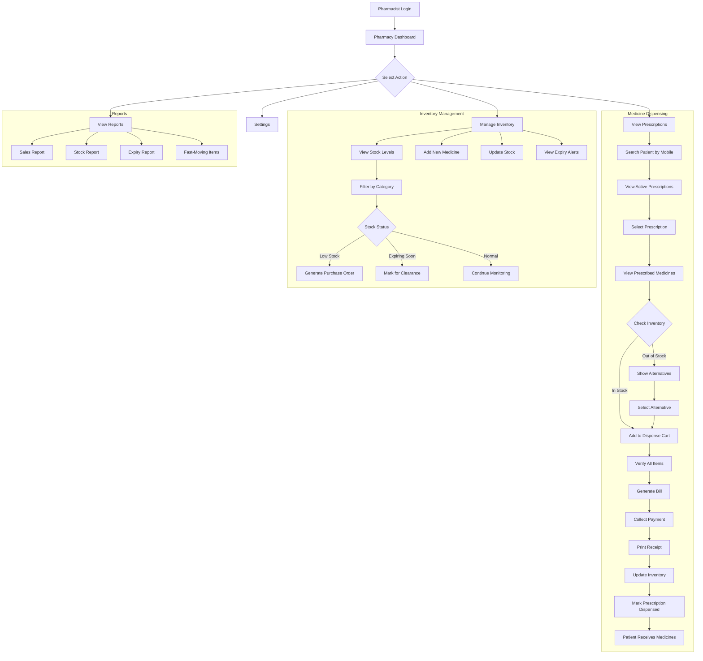
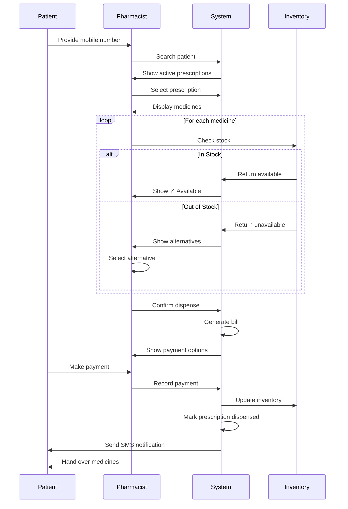
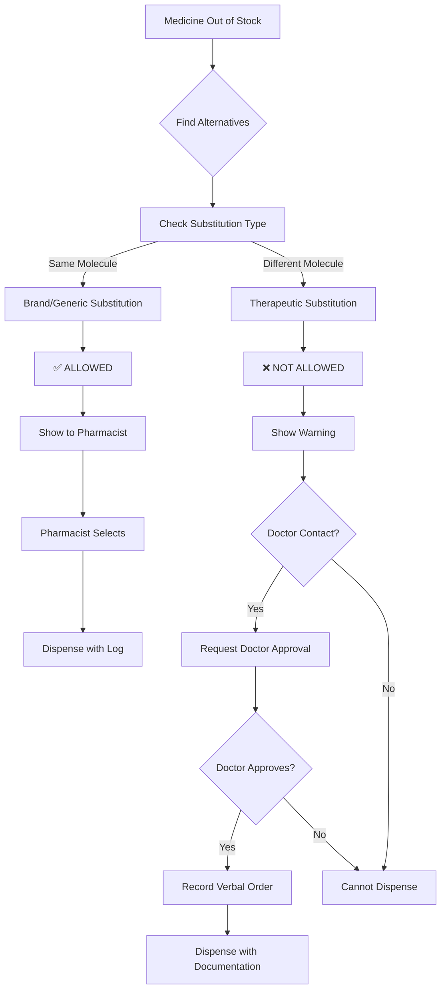
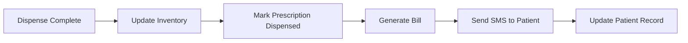

# Pharmacy Module Specification

## Overview

The Pharmacy Module manages medicine dispensing, inventory tracking, and pharmacy billing. Pharmacists use this portal to view e-prescriptions from doctors, check inventory availability, dispense medications, and generate pharmacy bills. The module maintains real-time inventory updates and alerts for low stock and expiring medicines.

---

## Role-Based Access Control

| Permission | Access Level |
|------------|--------------|
| View prescriptions | Full |
| Dispense medicines | Full |
| View inventory | Full |
| Update inventory | Full |
| Generate bills | Full |
| Process payments | Full |
| View reports | Full |
| Manage suppliers | Full |
| Add new medicines | Full |

---

## User Journey Flow



---

## Feature Specifications

### 1. Pharmacy Dashboard

#### 1.1 Dashboard Components

| Component | Description | Data Source |
|-----------|-------------|-------------|
| Pending Prescriptions | Count of undispensed prescriptions | `prescriptions` |
| Today's Sales | Revenue for the day | `payments` |
| Low Stock Alerts | Medicines below reorder level | `inventory` |
| Expiry Alerts | Medicines expiring in 30 days | `inventory` |
| Quick Search | Find patient/prescription | - |
| Recent Transactions | Last 10 dispensed orders | `pharmacy_dispense` |

#### 1.2 Dashboard Stats API

```
GET /api/pharmacy/dashboard-stats
```

Response:
```json
{
  "success": true,
  "data": {
    "pendingPrescriptions": 12,
    "todaySales": 45000,
    "lowStockItems": 8,
    "expiringItems": 5,
    "recentTransactions": [
      {
        "id": "uuid",
        "patientName": "John Doe",
        "amount": 1250,
        "time": "10:30 AM"
      }
    ]
  }
}
```

---

### 2. Prescription Processing

#### 2.1 Patient Search

**Search Options:**
| Search By | Format | Example |
|-----------|--------|---------|
| Mobile Number | 10 digits | 9876543210 |
| Prescription Number | PRX-XXXXXX | PRX-001234 |
| Patient ID | PT-XXXXXX | PT-001234 |
| Patient Name | Text | John Doe |

**API Endpoint:**
```
GET /api/pharmacy/patients/search?mobile=9876543210
GET /api/pharmacy/prescriptions/search?number=PRX-001234
```

#### 2.2 Active Prescriptions View

**Prescription List:**
| Prescription # | Patient | Doctor | Date | Items | Status | Actions |
|----------------|---------|--------|------|-------|--------|---------|
| PRX-001234 | John Doe | Dr. Kumar | 01-Mar | 3 | Pending | [View] [Dispense] |
| PRX-001235 | Sarah W | Dr. Singh | 01-Mar | 2 | Partial | [Complete] |
| PRX-001236 | Mike C | Dr. Patel | 28-Feb | 4 | Dispensed | [View] |

**Status Types:**
| Status | Description |
|--------|-------------|
| Pending | Not yet dispensed |
| Partial | Some items dispensed |
| Dispensed | All items dispensed |
| Cancelled | Prescription cancelled |

**API Endpoint:**
```
GET /api/pharmacy/prescriptions/pending
GET /api/pharmacy/prescriptions/:id
```

#### 2.3 Prescription Detail View

**Prescription Display:**
```
┌─────────────────────────────────────────────────────┐
│  PRESCRIPTION: PRX-001234                           │
│  Date: 01-Mar-2026                                  │
├─────────────────────────────────────────────────────┤
│  PATIENT INFORMATION                                │
│  Name: John Doe                                     │
│  Patient ID: PT-001234                              │
│  Mobile: 9876543210                                 │
│  Age/Gender: 35 / Male                              │
├─────────────────────────────────────────────────────┤
│  PRESCRIBED BY                                      │
│  Dr. Rajesh Kumar (Cardiology)                      │
│  Consultation: 01-Mar-2026                          │
├─────────────────────────────────────────────────────┤
│  MEDICINES                                          │
│  ┌─────────────────────────────────────────────┐   │
│  │ 1. Amlodipine 5mg                           │   │
│  │    Dosage: 1 tablet | Frequency: OD         │   │
│  │    Duration: 30 days | Qty: 30              │   │
│  │    Instructions: Morning, after breakfast   │   │
│  │    Stock: ✓ Available (150 units)           │   │
│  │    Price: ₹5/tablet | Total: ₹150           │   │
│  └─────────────────────────────────────────────┘   │
│  ┌─────────────────────────────────────────────┐   │
│  │ 2. Telmisartan 40mg                         │   │
│  │    Dosage: 1 tablet | Frequency: OD         │   │
│  │    Duration: 30 days | Qty: 30              │   │
│  │    Instructions: Evening                    │   │
│  │    Stock: ⚠️ Low (25 units)                 │   │
│  │    Price: ₹8/tablet | Total: ₹240           │   │
│  └─────────────────────────────────────────────┘   │
│  ┌─────────────────────────────────────────────┐   │
│  │ 3. Atorvastatin 10mg                        │   │
│  │    Dosage: 1 tablet | Frequency: OD         │   │
│  │    Duration: 30 days | Qty: 30              │   │
│  │    Instructions: Night                      │   │
│  │    Stock: ✗ Out of Stock                    │   │
│  │    [View Alternatives]                      │   │
│  └─────────────────────────────────────────────┘   │
│                                                     │
│  Doctor Notes: Complete full course                │
├─────────────────────────────────────────────────────┤
│  BILL SUMMARY                                       │
│  Subtotal: ₹630                                     │
│  Tax (5%): ₹31.50                                   │
│  Total: ₹661.50                                     │
│                                                     │
│  [Print] [Dispense All] [Partial Dispense]         │
└─────────────────────────────────────────────────────┘
```

**API Endpoint:**
```
GET /api/pharmacy/prescriptions/:id/details
```

---

### 3. Medicine Dispensing

#### 3.1 Dispensing Workflow



#### 3.2 Inventory Check

**Stock Status Indicators:**
| Status | Icon | Condition |
|--------|------|-----------|
| Available | ✓ Green | Stock > Reorder Level |
| Low Stock | ⚠️ Yellow | Stock ≤ Reorder Level |
| Out of Stock | ✗ Red | Stock = 0 |
| Expiring Soon | 🕐 Orange | Expiry < 90 days |

**API Endpoint:**
```
GET /api/pharmacy/medicines/:id/stock
```

#### 3.3 Alternative Medicines & Substitution Rules

**⚠️ LEGAL COMPLIANCE NOTICE (India)**

In India, pharmacists must understand the critical distinction between **Brand Substitution** and **Therapeutic Substitution**. The system must enforce these rules to ensure legal compliance.

##### Substitution Types

| Type | Definition | Legal Status | Example |
|------|------------|--------------|---------|
| **Brand Substitution** | Same molecule/salt, different brand name | ✅ **ALLOWED** without doctor approval | Lipitor 10mg → Atorva 10mg (both Atorvastatin) |
| **Generic Substitution** | Same molecule, generic version | ✅ **ALLOWED** without doctor approval | Lipitor 10mg → Atorvastatin 10mg (generic) |
| **Therapeutic Substitution** | Different molecule, similar action | ❌ **NOT ALLOWED** without doctor approval | Atorvastatin → Rosuvastatin (different statin) |

##### Substitution Decision Flow



##### Alternative Selection Interface

**When Out of Stock:**
```
┌─────────────────────────────────────────────────────┐
│  ATORVASTATIN 10mg (Lipitor) - OUT OF STOCK         │
├─────────────────────────────────────────────────────┤
│  ✅ BRAND SUBSTITUTES (Same Molecule - Allowed)     │
│  ┌─────────────────────────────────────────────┐   │
│  │ ○ Atorva 10mg (Atorvastatin)                │   │
│  │   Brand: Zydus | Price: ₹4/tablet           │   │
│  │   Stock: 200 units                          │   │
│  │   ✅ Can dispense without doctor approval   │   │
│  └─────────────────────────────────────────────┘   │
│  ┌─────────────────────────────────────────────┐   │
│  │ ○ Atorvastatin 10mg (Generic)               │   │
│  │   Generic | Price: ₹3/tablet                │   │
│  │   Stock: 500 units                          │   │
│  │   ✅ Can dispense without doctor approval   │   │
│  └─────────────────────────────────────────────┘   │
│                                                     │
│  ⚠️ THERAPEUTIC ALTERNATIVES (Different Molecule)  │
│  ┌─────────────────────────────────────────────┐   │
│  │ ○ Rosuvastatin 10mg                         │   │
│  │   Brand: CRESTOR | Price: ₹6/tablet         │   │
│  │   Stock: 150 units                          │   │
│  │   ⚠️ REQUIRES DOCTOR APPROVAL               │   │
│  │   [Request Doctor Call]                     │   │
│  └─────────────────────────────────────────────┘   │
│                                                     │
│  [Cancel] [Select Brand Substitute]                 │
└─────────────────────────────────────────────────────┘
```

##### Substitution Data Model

```prisma
model Medicine {
  // ... existing fields
  moleculeId          String?   @map("molecule_id")  // Links to same molecule
  therapeuticClassId  String?   @map("therapeutic_class_id") // Links to therapeutic class
  substitutionType    String?   @map("substitution_type") // brand, generic, therapeutic
}

model MedicineSubstitution {
  id                  String   @id @default(uuid())
  originalMedicineId  String   @map("original_medicine_id")
  substituteMedicineId String  @map("substitute_medicine_id")
  substitutionType    String   // BRAND, GENERIC, THERAPEUTIC
  requiresApproval    Boolean  @default(false)
  isActive            Boolean  @default(true)
  
  originalMedicine    Medicine @relation("OriginalSubstitute", fields: [originalMedicineId], references: [id])
  substituteMedicine  Medicine @relation("SubstituteMedicine", fields: [substituteMedicineId], references: [id])
  
  @@map("medicine_substitutions")
}

model SubstitutionLog {
  id                  String   @id @default(uuid())
  prescriptionItemId  String   @map("prescription_item_id")
  originalMedicineId  String   @map("original_medicine_id")
  substitutedMedicineId String @map("substituted_medicine_id")
  substitutionType    String
  doctorApprovalRequired Boolean
  doctorApprovalObtained Boolean @default(false)
  doctorApprovalNote  String?
  pharmacistId        String
  createdAt           DateTime @default(now())
  
  @@map("substitution_logs")
}
```

##### Substitution API Endpoints

**Get Allowed Substitutes:**
```
GET /api/pharmacy/medicines/:id/substitutes
```

Response:
```json
{
  "success": true,
  "data": {
    "medicine": {
      "id": "uuid",
      "name": "Lipitor 10mg",
      "molecule": "Atorvastatin"
    },
    "brandSubstitutes": [
      {
        "id": "uuid",
        "name": "Atorva 10mg",
        "molecule": "Atorvastatin",
        "price": 4,
        "stock": 200,
        "requiresApproval": false
      }
    ],
    "therapeuticAlternatives": [
      {
        "id": "uuid",
        "name": "Rosuvastatin 10mg",
        "molecule": "Rosuvastatin",
        "price": 6,
        "stock": 150,
        "requiresApproval": true,
        "warningMessage": "Different molecule - requires doctor approval"
      }
    ]
  }
}
```

**Log Therapeutic Substitution with Doctor Approval:**
```
POST /api/pharmacy/substitutions/log
```

Request:
```json
{
  "prescriptionItemId": "uuid",
  "originalMedicineId": "uuid",
  "substitutedMedicineId": "uuid",
  "substitutionType": "THERAPEUTIC",
  "doctorApprovalObtained": true,
  "doctorApprovalNote": "Dr. Kumar approved via phone at 10:45 AM",
  "pharmacistId": "uuid"
}
```

##### Compliance Rules

1. **Brand/Generic Substitution:**
   - Automatically allowed
   - Log the substitution for audit
   - No additional approval needed

2. **Therapeutic Substitution:**
   - System blocks direct dispensing
   - Must request doctor approval
   - Record verbal order with timestamp
   - Doctor name and contact time mandatory

3. **Audit Trail:**
   - All substitutions logged
   - Include reason for substitution
   - Doctor approval documentation
   - Available for regulatory inspection

#### 3.4 Dispense API

**Create Dispense Record:**
```
POST /api/pharmacy/dispense
```

Request:
```json
{
  "prescriptionId": "uuid",
  "items": [
    {
      "prescriptionItemId": "uuid",
      "medicineId": "uuid",
      "quantityDispensed": 30,
      "batchNumber": "BTH001",
      "expiryDate": "2027-12-31"
    }
  ],
  "payment": {
    "method": "cash",
    "amount": 661.50
  },
  "notes": "All items dispensed"
}
```

Response:
```json
{
  "success": true,
  "data": {
    "dispenseId": "uuid",
    "billNumber": "PHM-2026-000123",
    "prescriptionId": "uuid",
    "patientName": "John Doe",
    "items": [
      {
        "medicine": "Amlodipine 5mg",
        "quantity": 30,
        "amount": 150
      }
    ],
    "totalAmount": 661.50,
    "paymentStatus": "paid",
    "receiptUrl": "/receipts/PHM-2026-000123"
  }
}
```

---

### 4. Inventory Management

#### 4.1 Inventory Dashboard

**Stock Overview:**
| Category | Total Items | Low Stock | Out of Stock | Expiring Soon |
|----------|-------------|-----------|--------------|---------------|
| Cardiology | 45 | 3 | 1 | 2 |
| Antibiotics | 62 | 5 | 2 | 3 |
| Pain Relief | 38 | 2 | 0 | 1 |
| Vitamins | 55 | 4 | 1 | 5 |

**API Endpoint:**
```
GET /api/pharmacy/inventory/overview
```

#### 4.2 Stock List

**Inventory List View:**
| Medicine | Category | Stock | Reorder Level | Status | Expiry | Actions |
|----------|----------|-------|---------------|--------|--------|---------|
| Amlodipine 5mg | Cardiology | 150 | 50 | ✓ Normal | Dec 2027 | [Edit] |
| Telmisartan 40mg | Cardiology | 25 | 30 | ⚠️ Low | Jun 2027 | [Reorder] |
| Metformin 500mg | Diabetes | 0 | 100 | ✗ Out | - | [Reorder] |
| Amoxicillin 250mg | Antibiotics | 200 | 50 | ✓ Normal | Mar 2027 | [Edit] |

**API Endpoints:**
```
GET  /api/pharmacy/inventory
GET  /api/pharmacy/inventory/:id
PUT  /api/pharmacy/inventory/:id
POST /api/pharmacy/inventory/:id/restock
```

#### 4.3 Low Stock Alerts

**Alert Threshold:**
```
Low Stock = Current Stock ≤ Reorder Level
Critical = Current Stock ≤ (Reorder Level / 2)
```

**Alert Display:**
```
┌─────────────────────────────────────────────────────┐
│  ⚠️ LOW STOCK ALERTS (8 items)                      │
├─────────────────────────────────────────────────────┤
│  Medicine          │ Stock │ Reorder │ Action      │
│  Telmisartan 40mg  │   25  │   30    │ [Reorder]   │
│  Metformin 500mg   │    0  │  100    │ [Urgent]    │
│  Omeprazole 20mg   │   15  │   25    │ [Reorder]   │
│  ...               │       │         │             │
├─────────────────────────────────────────────────────┤
│  [Generate Purchase Order] [Export List]           │
└─────────────────────────────────────────────────────┘
```

**API Endpoint:**
```
GET /api/pharmacy/inventory/low-stock
```

#### 4.4 Expiry Management

**Expiry Categories:**
| Category | Timeframe | Action |
|----------|-----------|--------|
| Expired | < Today | Remove from sale |
| Critical | < 30 days | Priority clearance |
| Warning | < 90 days | Mark for attention |
| Normal | > 90 days | Regular monitoring |

**Expiry Alert View:**
```
┌─────────────────────────────────────────────────────┐
│  🕐 EXPIRY ALERTS                                   │
├─────────────────────────────────────────────────────┤
│  EXPIRED (Remove Immediately)                       │
│  • Paracetamol 500mg - Batch B123 - Exp: 28-Feb     │
│  • Cough Syrup 100ml - Batch C456 - Exp: 15-Feb     │
│                                                     │
│  EXPIRING IN 30 DAYS                                │
│  • Vitamin D3 1000IU - Batch D789 - Exp: 25-Mar     │
│  • Calcium 500mg - Batch E012 - Exp: 30-Mar         │
│                                                     │
│  EXPIRING IN 90 DAYS                                │
│  • Iron Supplement - Batch F345 - Exp: 15-May       │
│  • Multivitamin - Batch G678 - Exp: 28-May          │
│                                                     │
│  [Mark as Removed] [Print Clearance List]          │
└─────────────────────────────────────────────────────┘
```

**API Endpoints:**
```
GET  /api/pharmacy/inventory/expiry-alerts
PUT  /api/pharmacy/inventory/:id/mark-expired
POST /api/pharmacy/inventory/clearance-list
```

#### 4.5 Add/Update Medicine

**Medicine Form:**
| Field | Type | Required |
|-------|------|----------|
| Medicine Name | Text | Yes |
| Generic Name | Text | No |
| Category | Select | Yes |
| Form | Select | Yes |
| Strength | Text | Yes |
| Unit | Text | Yes |
| Selling Price | Number | Yes |
| Cost Price | Number | No |
| Requires Prescription | Checkbox | Yes |
| Batch Number | Text | Yes |
| Quantity | Number | Yes |
| Reorder Level | Number | Yes |
| Expiry Date | Date | Yes |
| Supplier | Select | No |

**Medicine Forms:**
- Tablet
- Capsule
- Syrup
- Injection
- Cream/Ointment
- Drops
- Inhaler

**API Endpoints:**
```
POST /api/pharmacy/medicines
PUT  /api/pharmacy/medicines/:id
POST /api/pharmacy/inventory/batch
```

---

### 5. Pharmacy Billing

#### 5.1 Bill Generation

**Bill Components:**
| Component | Calculation |
|-----------|-------------|
| Item Total | Quantity × Rate |
| Subtotal | Sum of all items |
| Discount | If applicable |
| Tax | 5% GST on medicines |
| Grand Total | Subtotal - Discount + Tax |

**Bill Format:**
```
┌─────────────────────────────────────────────────────┐
│              CITY HOSPITAL PHARMACY                 │
│         GSTIN: 27XXXXX1234X1Z5                      │
├─────────────────────────────────────────────────────┤
│ Bill: PHM-2026-000123      Date: 01/03/2026 10:45  │
│ Patient: John Doe          Mobile: 9876543210      │
│ Prescription: PRX-001234   Doctor: Dr. Kumar       │
├─────────────────────────────────────────────────────┤
│ Item                  │  Rate  │  Qty  │  Amount   │
├─────────────────────────────────────────────────────┤
│ Amlodipine 5mg        │   5    │  30   │   150     │
│ Telmisartan 40mg      │   8    │  30   │   240     │
│ Atorvastatin 10mg     │   8    │  30   │   240     │
├─────────────────────────────────────────────────────┤
│ Subtotal              │        │       │   630     │
│ GST (5%)              │        │       │    31.50  │
├─────────────────────────────────────────────────────┤
│ GRAND TOTAL           │        │       │   661.50  │
└─────────────────────────────────────────────────────┘
│ Payment: CASH         │ Paid   │       │   661.50  │
└─────────────────────────────────────────────────────┘
```

#### 5.2 Payment Processing

**Payment Methods:**
| Method | Processing |
|--------|------------|
| Cash | Manual entry |
| UPI | QR Code / UPI ID |
| Card | POS Machine |

**API Endpoint:**
```
POST /api/pharmacy/bills/:id/payment
```

Request:
```json
{
  "paymentMethod": "cash",
  "amount": 661.50,
  "receivedBy": "pharmacist_user_id"
}
```

---

### 6. Reports

#### 6.1 Sales Report

**Daily Sales:**
| Date | Transactions | Revenue | Items Sold |
|------|--------------|---------|------------|
| 01-Mar | 45 | ₹32,500 | 180 |
| 28-Feb | 52 | ₹38,200 | 210 |
| 27-Feb | 38 | ₹28,900 | 155 |

**API Endpoint:**
```
GET /api/pharmacy/reports/sales?period=daily&date=2026-03-01
```

#### 6.2 Stock Report

**Stock Summary:**
| Category | Total SKUs | Total Units | Value |
|----------|------------|-------------|-------|
| Cardiology | 45 | 2,500 | ₹1,25,000 |
| Antibiotics | 62 | 3,200 | ₹1,60,000 |
| Pain Relief | 38 | 1,800 | ₹54,000 |

**API Endpoint:**
```
GET /api/pharmacy/reports/stock
```

#### 6.3 Fast-Moving Items

**Top Selling Medicines:**
| Rank | Medicine | Units Sold (Month) | Revenue |
|------|----------|-------------------|---------|
| 1 | Paracetamol 500mg | 850 | ₹8,500 |
| 2 | Amoxicillin 250mg | 620 | ₹18,600 |
| 3 | Omeprazole 20mg | 480 | ₹14,400 |

**API Endpoint:**
```
GET /api/pharmacy/reports/fast-moving
```

---

## UI Components Required

### Pages

| Page | Route | Description |
|------|-------|-------------|
| Dashboard | `/pharmacy/dashboard` | Overview and alerts |
| Prescriptions | `/pharmacy/prescriptions` | Pending prescriptions |
| Dispense | `/pharmacy/dispense/:id` | Dispensing form |
| Inventory | `/pharmacy/inventory` | Stock management |
| Medicine Detail | `/pharmacy/medicine/:id` | Medicine info |
| Bills | `/pharmacy/bills` | Bill history |
| Reports | `/pharmacy/reports` | Analytics |

### Components

| Component | Description |
|-----------|-------------|
| `PrescriptionCard` | Prescription summary |
| `MedicineList` | Prescribed medicines |
| `StockIndicator` | Availability status |
| `AlternativeSelector` | Choose alternatives |
| `DispenseCart` | Items to dispense |
| `BillGenerator` | Create pharmacy bill |
| `InventoryTable` | Stock list |
| `ExpiryAlert` | Expiry warning |
| `LowStockAlert` | Reorder reminder |

---

## Database Tables Used

| Table | Purpose |
|-------|---------|
| `medicines` | Medicine master data |
| `inventory` | Stock levels |
| `prescriptions` | Doctor prescriptions |
| `prescription_items` | Individual medicines |
| `pharmacy_dispense` | Dispense records |
| `dispense_items` | Items dispensed |
| `bills` | Pharmacy bills |
| `payments` | Payment records |
| `patients` | Patient info |

---

## Integration Points

| Module | Integration Type |
|--------|------------------|
| Doctor Module | Receive prescriptions |
| Patient Module | View prescriptions |
| Billing Module | Payment processing |
| Notification Service | SMS alerts |
| Inventory System | Stock updates |

---

## API Endpoints Summary

### Dashboard
```
GET /api/pharmacy/dashboard-stats
```

### Prescriptions
```
GET /api/pharmacy/prescriptions/pending
GET /api/pharmacy/prescriptions/:id
GET /api/pharmacy/prescriptions/:id/details
```

### Dispensing
```
POST /api/pharmacy/dispense
GET  /api/pharmacy/dispense/:id
```

### Inventory
```
GET  /api/pharmacy/inventory
GET  /api/pharmacy/inventory/:id
PUT  /api/pharmacy/inventory/:id
POST /api/pharmacy/inventory/:id/restock
GET  /api/pharmacy/inventory/low-stock
GET  /api/pharmacy/inventory/expiry-alerts
```

### Medicines
```
GET  /api/pharmacy/medicines
POST /api/pharmacy/medicines
PUT  /api/pharmacy/medicines/:id
GET  /api/pharmacy/medicines/:id/alternatives
GET  /api/pharmacy/medicines/:id/stock
```

### Billing
```
GET  /api/pharmacy/bills
POST /api/pharmacy/bills/:id/payment
```

### Reports
```
GET /api/pharmacy/reports/sales
GET /api/pharmacy/reports/stock
GET /api/pharmacy/reports/fast-moving
```

---

## Implementation Priority

| Priority | Feature | Dependencies |
|----------|---------|--------------|
| P0 | View Prescriptions | Prescription system |
| P0 | Dispense Medicines | Inventory |
| P0 | Inventory Check | Inventory system |
| P1 | Inventory Management | None |
| P1 | Billing | Payment system |
| P1 | Low Stock Alerts | Inventory |
| P2 | Expiry Management | Inventory |
| P2 | Reports | All features |
| P3 | Alternative Suggestions | Medicine database |

---

## System Actions

### When Prescription Dispensed



### Inventory Update Trigger

```
New Stock = Current Stock - Quantity Dispensed

If New Stock <= Reorder Level:
    - Mark as Low Stock
    - Send alert to pharmacist
    - Generate purchase order suggestion
```

---

## Notes for Development

1. **Real-time Inventory**: Update stock immediately on dispense
2. **Batch Tracking**: Track which batch was dispensed for recalls
3. **FIFO**: Suggest oldest batch first (by expiry)
4. **Barcode Scanning**: Support barcode scanner for quick entry
5. **Offline Mode**: Cache inventory for offline access
6. **Audit Trail**: Log all inventory changes
7. **Auto-Reorder**: Generate alerts when stock reaches reorder level
8. **Generic Suggestions**: Show generic alternatives for cost savings
9. **Drug Interactions**: Alert for potential drug interactions (future)
10. **Temperature Tracking**: For cold storage items (future)
