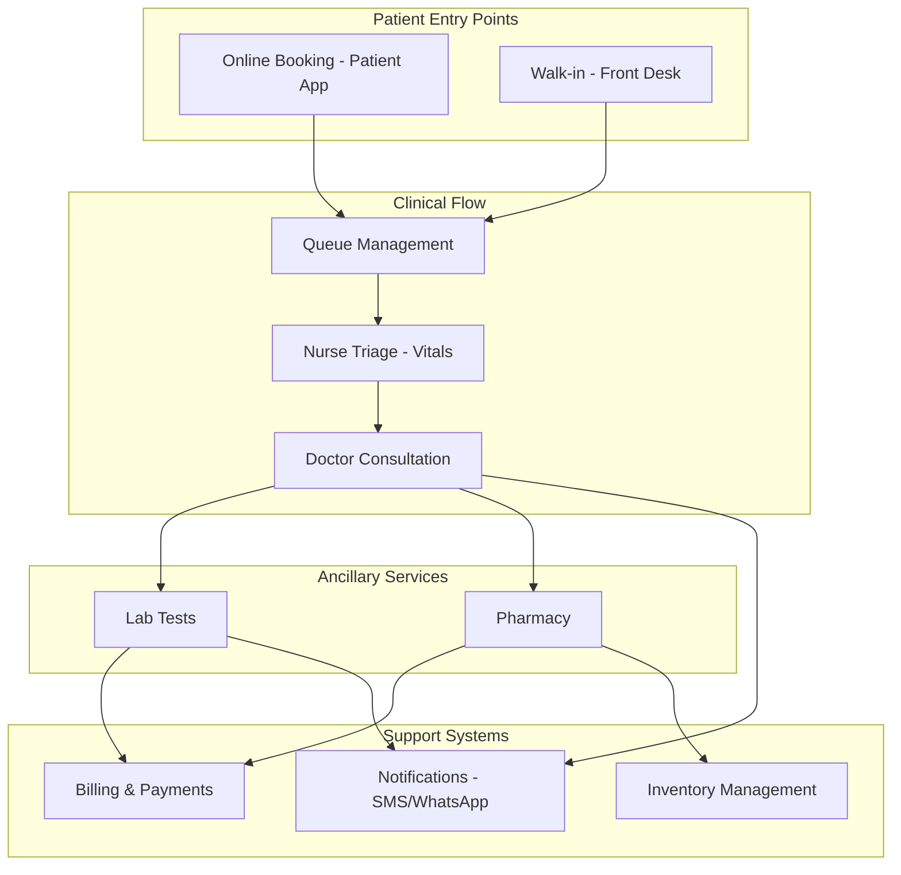
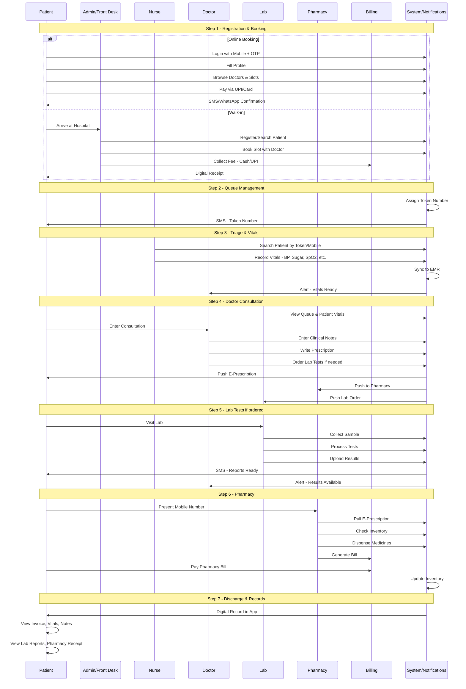
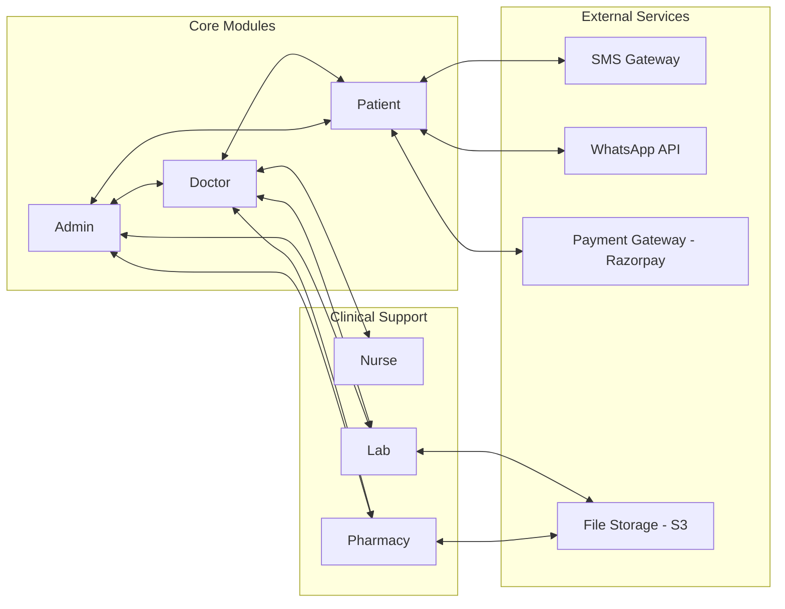

# HMS Module Specifications - Index

## Overview

This directory contains detailed specification documents for each module of the Hospital Management System (HMS). Each specification includes user journeys, feature breakdowns, API endpoints, database requirements, and implementation priorities.

---

## Module Documents

| Module | Document | Primary Users | Key Features |
|--------|----------|---------------|--------------|
| [Doctor](./Doctor-Module.md) | Doctor Module Specification | Doctors | Queue management, Consultation, ICD-10 coding, Prescriptions, Lab orders |
| [Patient](./Patient-Module.md) | Patient Module Specification | Patients (Mobile/Web) | ABHA ID, OTP auth, Online booking, Dependents management |
| [Admin](./Admin-Module.md) | Admin Module Specification | Admin Staff, Front Desk | Walk-in registration, Billing, Doctor payouts, Reports |
| [Nurse](./Nurse-Module.md) | Nurse Module Specification | Nurses | Vitals recording, Abnormal alerts, Queue integration |
| [Pharmacy](./Pharmacy-Module.md) | Pharmacy Module Specification | Pharmacists | E-prescriptions, Inventory, Substitution rules |
| [Lab](./Lab-Module.md) | Lab Module Specification | Lab Technicians | Sample collection, Results entry, Critical alerts |
| [Architecture](./Architecture-Enhancements.md) | Architecture Enhancements | Developers | Multi-tenancy, Event-driven, Centralized billing |

---

## Critical Architecture Enhancements

### ⚠️ Must-Read Before Development

The following enhancements are **mandatory** for a production-ready system:

| Enhancement | Document Section | Priority | Why Required |
|-------------|------------------|----------|--------------|
| **ABDM Compliance (ABHA ID)** | [Patient Module](./Patient-Module.md#abdm-compliance) | P0 | Regulatory requirement in India |
| **Multi-Tenancy** | [Architecture - Section 1](./Architecture-Enhancements.md#1-multi-tenancy-architecture-saas-model) | P0 | Required for SaaS model |
| **Event-Driven Architecture** | [Architecture - Section 4](./Architecture-Enhancements.md#4-event-driven-architecture) | P0 | System reliability |
| **Centralized Billing** | [Architecture - Section 2](./Architecture-Enhancements.md#2-centralized-billing-system-master-bill) | P1 | Patient experience |
| **Queue Hold/Skip** | [Architecture - Section 3](./Architecture-Enhancements.md#3-queue-management-enhancements) | P1 | Real-world scenarios |
| **ICD-10 Coding** | [Doctor Module](./Doctor-Module.md#43-icd-10-coding-integration) | P1 | Insurance/TPA claims |
| **Pharmacy Substitution Rules** | [Pharmacy Module](./Pharmacy-Module.md#33-alternative-medicines--substitution-rules) | P1 | Legal compliance |
| **Dependents Management** | [Patient Module](./Patient-Module.md#8-dependents-management-family-profiles) | P2 | Common Indian use case |

---

## System Architecture



---

## Complete Patient Lifecycle



---

## Key Features by Module

### Doctor Module
- Dashboard with AI-powered summary
- Real-time queue management
- Patient consultation workflow
- E-prescription generation
- Lab test ordering
- Results review with alerts
- Payout tracking

### Patient Module
- OTP-based authentication
- Online doctor browsing & booking
- UPI/Card payment integration
- Real-time queue tracking
- Digital medical records
- Prescription & lab report access
- WhatsApp/SMS notifications

### Admin Module
- Front desk operations
- Walk-in patient registration
- User/staff management
- Billing & payment processing
- Doctor payout management
- Comprehensive reporting
- System configuration

### Nurse Module
- Patient search (mobile/token)
- Vitals recording form
- Abnormal value alerts
- Queue integration
- Medical history access
- Real-time doctor notifications

### Pharmacy Module
- E-prescription processing
- Inventory management
- Low stock & expiry alerts
- Alternative medicine suggestions
- Pharmacy billing
- Stock reports

### Lab Module
- Test order management
- Sample collection workflow
- Result entry with validation
- Critical value alerts
- PDF report generation
- Test catalog management

---

## Integration Points



---

## Database Schema Overview

### Core Tables
| Table | Description |
|-------|-------------|
| `users` | Staff accounts (doctors, nurses, admins, etc.) |
| `patients` | Patient demographics |
| `appointments` | Booked appointments |
| `queue_entries` | Daily token queue |

### Clinical Tables
| Table | Description |
|-------|-------------|
| `vitals` | Patient vital signs |
| `consultations` | Doctor consultation records |
| `prescriptions` | Medicine prescriptions |
| `prescription_items` | Individual medicines |
| `medical_history` | Pre-existing conditions |

### Lab Tables
| Table | Description |
|-------|-------------|
| `lab_tests` | Test master catalog |
| `lab_orders` | Test orders |
| `lab_order_items` | Individual test results |

### Pharmacy Tables
| Table | Description |
|-------|-------------|
| `medicines` | Medicine master |
| `inventory` | Stock levels |
| `pharmacy_dispense` | Dispense records |
| `dispense_items` | Items dispensed |

### Billing Tables
| Table | Description |
|-------|-------------|
| `bills` | Invoices |
| `bill_items` | Invoice line items |
| `payments` | Payment records |

### System Tables
| Table | Description |
|-------|-------------|
| `notifications` | User notifications |
| `audit_logs` | Activity tracking |
| `refresh_tokens` | Auth tokens |

---

## API Structure

### Base URL
```
/api/{module}/{resource}
```

### Common Endpoints Pattern
```
GET    /api/{module}/{resource}       # List
POST   /api/{module}/{resource}       # Create
GET    /api/{module}/{resource}/:id   # Get by ID
PUT    /api/{module}/{resource}/:id   # Update
DELETE /api/{module}/{resource}/:id   # Delete
```

### Authentication
- JWT-based authentication
- Role-based access control
- Token refresh mechanism

---

## Implementation Phases

### Phase 1 - Core (P0 Features)
- [ ] Authentication system with OTP
- [ ] Patient registration
- [ ] Doctor dashboard & queue
- [ ] Consultation workflow
- [ ] Prescription writing
- [ ] Front desk operations

### Phase 2 - Clinical Support (P1 Features)
- [ ] Nurse vitals recording
- [ ] Lab test ordering
- [ ] Lab result entry
- [ ] Pharmacy dispensing
- [ ] Inventory management
- [ ] Payment integration

### Phase 3 - Enhanced Features (P2 Features)
- [ ] Real-time notifications
- [ ] WhatsApp integration
- [ ] PDF report generation
- [ ] Analytics & reporting
- [ ] Doctor payouts

### Phase 4 - Advanced (P3 Features)
- [ ] AI-powered suggestions
- [ ] Drug interaction alerts
- [ ] Equipment integration
- [ ] Advanced analytics

---

## Technology Stack Reference

### Frontend
- React 18+ with TypeScript
- Redux Toolkit for state
- Material-UI / Tailwind CSS
- React Query for server state
- Framer Motion for animations

### Backend
- Node.js with Express
- PostgreSQL database
- Prisma ORM
- JWT authentication
- Redis for caching
- Bull for job queues

### External Services
- Razorpay for payments
- Twilio/MSG91 for SMS
- WhatsApp Business API
- AWS S3 for file storage

---

## Security Considerations

1. **Authentication**
   - OTP verification for patients
   - JWT tokens with refresh mechanism
   - Role-based access control

2. **Data Protection**
   - Encryption at rest
   - HTTPS for all communications
   - Audit logging for sensitive operations

3. **Compliance**
   - HIPAA guidelines for patient data
   - Data retention policies
   - Consent management

---

## Getting Started

1. Read the [Doctor Module](./Doctor-Module.md) specification first to understand the core clinical workflow
2. Review [Patient Module](./Patient-Module.md) for the patient-facing features
3. Check [Admin Module](./Admin-Module.md) for operational management
4. Explore [Nurse](./Nurse-Module.md), [Pharmacy](./Pharmacy-Module.md), and [Lab](./Lab-Module.md) for specialized workflows

---

## Contributing

When updating specifications:
1. Maintain consistent formatting across all documents
2. Update API endpoints in the respective module
3. Add new database fields to schema section
4. Update integration points if adding new modules
5. Run Mermaid diagram validation

---

## Version History

| Version | Date | Changes |
|---------|------|---------|
| 1.0 | 2026-03-01 | Initial module specifications |
